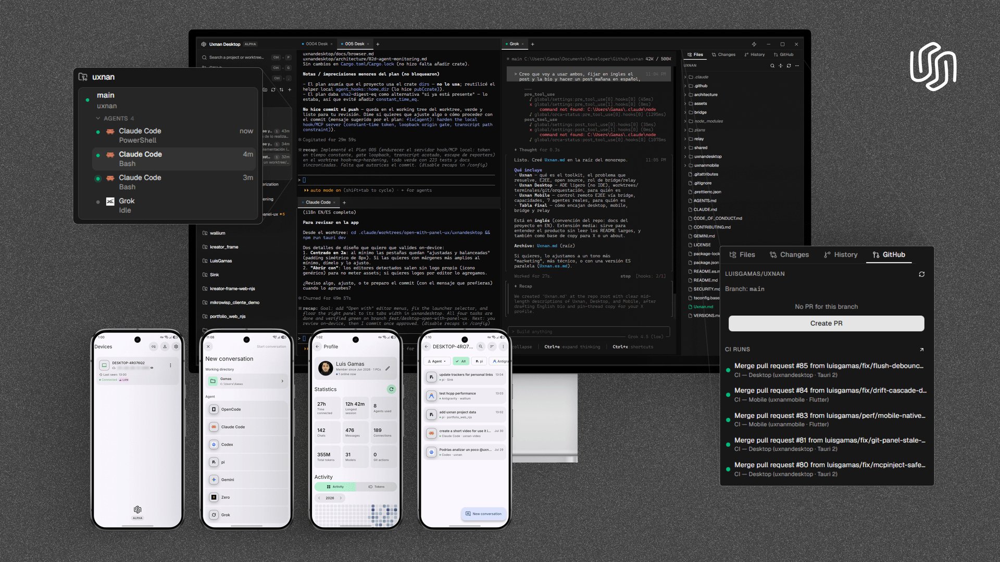
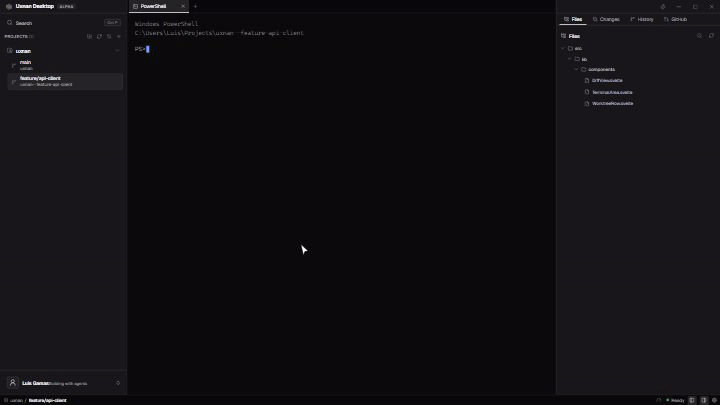
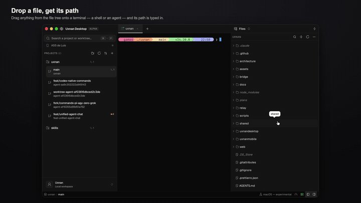
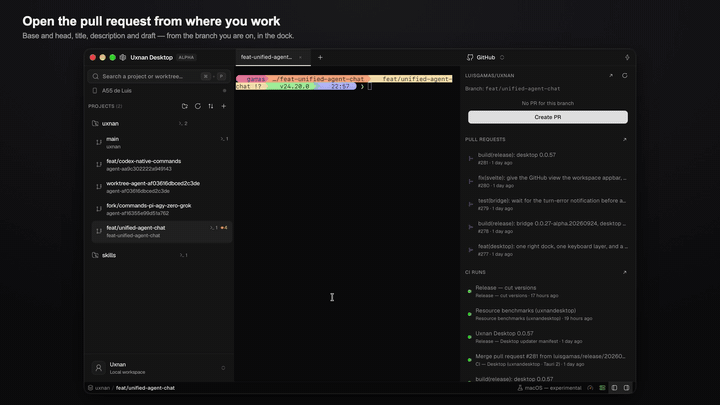
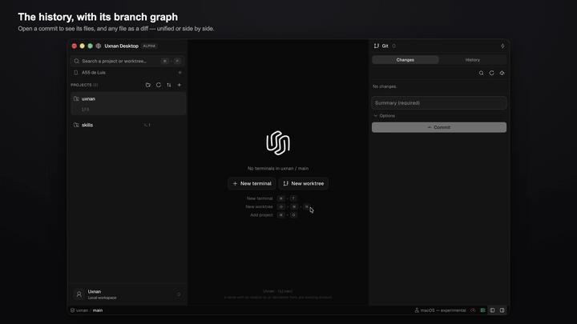
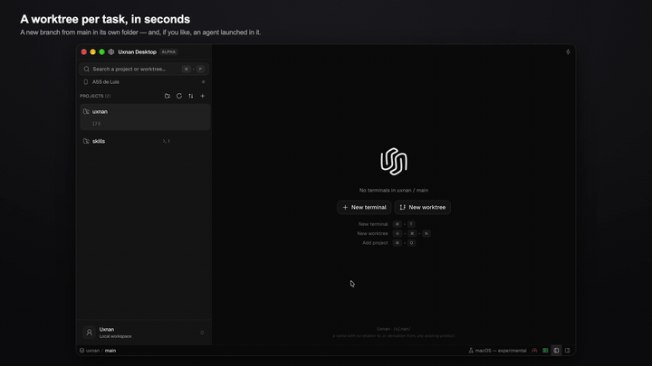
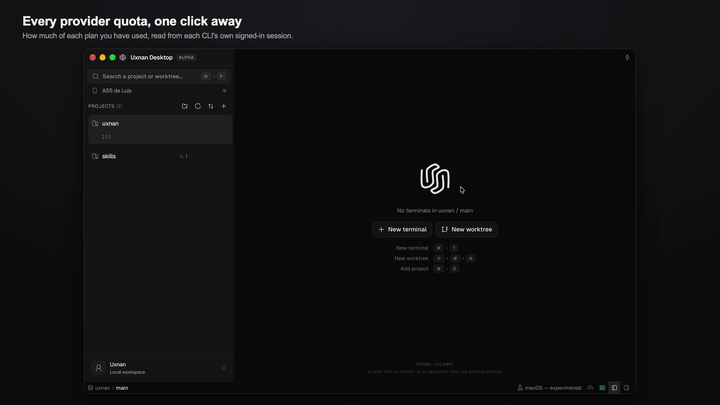
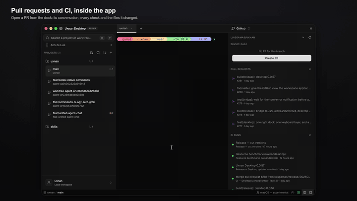
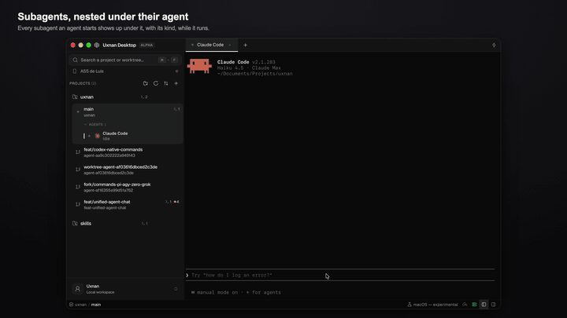
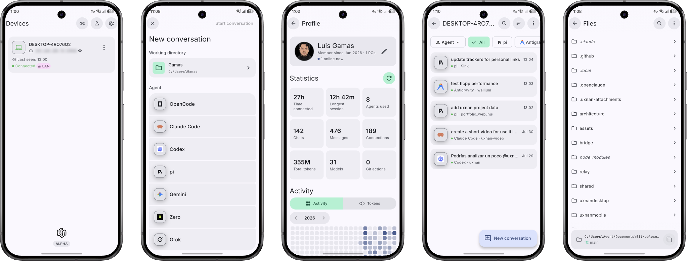

<p align="center">
  
</p>

<h1 align="center">Uxnan</h1>

<p align="center">
  <sub><i>Uxnan: un nombre sin relación ni derivación de ningún producto existente.</i></sub>
</p>

<p align="center">
  <a href="https://github.com/luisgamas/uxnan/stargazers"></a>
  <a href="https://github.com/luisgamas/uxnan/releases/latest"></a>
  <a href="LICENSE"></a>
  
</p>

<p align="center">
  <a href="README.md">Read in English</a> · Español
</p>

<p align="center">
  <b>Dos apps construidas alrededor de una idea: tus agentes de codificación no deberían<br />
  necesitar toda tu atención, ni tu máquina más cara, para seguir avanzando.</b>
</p>

<p align="center">
  <b>Uxnan Desktop</b> corre y revisa varios agentes de codificación CLI en paralelo, cada<br />
  uno en su propio git worktree, sin el costo de memoria de un IDE completo. <b>Uxnan<br />
  Mobile</b> se empareja con un pequeño daemon cifrado en tu PC para que puedas revisar un<br />
  agente, aprobar su siguiente paso o enviarle una nueva instrucción desde tu teléfono,<br />
  sea desde el otro lado del cuarto o desde el otro lado del mundo. Son apps independientes: usa<br />
  Desktop sola, Mobile sola, o ambas.
</p>

<p align="center">
  <a href="https://github.com/luisgamas/uxnan/releases/latest">
    
  </a>
  <a href="https://sink.gamas.workers.dev/uxnan-android">
    
  </a>
</p>

<p align="center">
  
</p>

## Cómo se siente usarlo

<table>
<tr>
<td width="46%" valign="top">

### Lanza cualquier agente en su propio worktree
Uxnan Desktop es terminal-céntrico, así que corre cualquier agente CLI: elige uno del catálogo (Claude Code, Codex, OpenCode, Pi, Grok, Antigravity, Zero) o registra cualquier otro a mano, y cae directo en una terminal aislada corriendo su propio binario oficial, bajo tu propia cuenta. Sin API keys, sin SDKs.

[Lanzamiento y configuración de agentes →](uxnandesktop/docs/agent-launch.md)

</td>
<td width="54%" valign="top">



</td>
</tr>
<tr>
<td width="46%" valign="top">

### Arrastra un archivo directo a la terminal
Arrastra cualquier archivo o carpeta del árbol sobre una terminal y su ruta se escribe ahí —entre comillas si lo necesita— así un agente nunca tiene que adivinar una ruta, y tú tampoco.

[Git, worktrees y el árbol de archivos →](uxnandesktop/architecture/02c-git-worktrees.md)

</td>
<td width="54%" valign="top">



</td>
</tr>
<tr>
<td width="46%" valign="top">

### Abre un PR sin salir de tu terminal
Haz push, elige `base ← head`, y crea el PR: uxnan lee las reglas de rama reales del repositorio y solo te ofrece los métodos de merge que en verdad tienes permitido usar.

[Integración con GitHub →](uxnandesktop/docs/github.md)

</td>
<td width="54%" valign="top">



</td>
</tr>
<tr>
<td width="46%" valign="top">

### Lee tu historial como un grafo
Un carril de grafo de ramas corre junto al log de commits: haz clic en un commit para expandir sus archivos modificados, haz clic en un archivo para abrir solo esa porción del diff en vez de un blob gigante.

[Git, worktrees y diffs →](uxnandesktop/architecture/02c-git-worktrees.md)

</td>
<td width="54%" valign="top">



</td>
</tr>
<tr>
<td width="46%" valign="top">

### Crea un worktree aislado en segundos
Rama nueva, rama existente, o una ubicación personalizada: cada tarea obtiene su propio worktree y su propio agente, así nada choca con lo que ya tienes corriendo.

[Creación de worktrees →](uxnandesktop/architecture/02c-git-worktrees.md)

</td>
<td width="54%" valign="top">



</td>
</tr>
<tr>
<td width="46%" valign="top">

### Conoce tu cuota antes de que se acabe
Uso de sesión, semanal y mensual para Codex, Claude, Copilot y Grok, leído directo del token con el que cada CLI ya inició sesión: nunca una key pegada, nunca una cookie.

[Estadísticas de uso por proveedor →](uxnandesktop/docs/providers.md)

</td>
<td width="54%" valign="top">



</td>
</tr>
<tr>
<td width="46%" valign="top">

### Revisa PRs, issues y CI en pantalla completa
Abre los Pull Requests, Issues y Actions de un proyecto en una vista enfocada que reemplaza el panel central: aprueba, haz merge, comenta o vuelve a correr un check sin cambiar de app.

[Integración con GitHub →](uxnandesktop/docs/github.md)

</td>
<td width="54%" valign="top">



</td>
</tr>
<tr>
<td width="46%" valign="top">

### Mira a los subagentes trabajar bajo su padre
Un subagente del Task tool de Claude Code (o una sesión hija de OpenCode) aparece en vivo como una fila anidada bajo el agente que lo generó, y el padre no marca "Listo" mientras un hijo sigue trabajando.

[Hooks de agentes y estados precisos →](uxnandesktop/docs/agent-hooks.md)

</td>
<td width="54%" valign="top">



</td>
</tr>
</table>

## También incluye

- **Pets**: un compañero animado opcional que refleja lo que están haciendo tus agentes y te lleva a la terminal correcta con un clic. [docs →](uxnandesktop/docs/pets.md)
- **Automations**: corridas multi-agente recurrentes que se disparan con su propio horario, registradas con el scheduler de tu propio sistema operativo, y funcionan incluso con uxnan cerrado. [docs →](uxnandesktop/docs/automations.md)
- **Una huella medida, no adivinada**: el modo de recursos (Eficiente / Balanceado / Rendimiento) gobierna el trabajo en segundo plano, y la cifra contra la que se ajusta está medida: **~250 MB** de memoria privada en Windows 11 (WebView2 150, build release). [modo de recursos →](uxnandesktop/docs/resource-mode.md) · [método del benchmark →](uxnandesktop/docs/resource-benchmarks.md)
- **Quick commands**: comandos de shell acotados a un proyecto o worktree, con variables de sustitución, lanzados desde un atajo en la barra superior. [detalles →](uxnandesktop/README.md)
- **Duerme, despierta, y sigue donde lo dejaste**: las terminales de un workspace inactivo (scrollback incluido) vuelven exactamente como las dejaste, y las sesiones CLI de los agentes se auto-resumen. [motor de terminal →](uxnandesktop/architecture/02b-terminal-engine.md)
- **Orquestación multi-agente**: difunde un mensaje a varios agentes a la vez, o encadénalos en una corrida durable con aprobaciones y reintentos. [docs →](uxnandesktop/docs/orchestration.md)
- **Una interfaz completamente traducida**: cada pantalla en inglés y español, no solo un puñado de textos. [i18n →](uxnandesktop/docs/i18n.md)
- **Auto-actualizaciones dentro de la app**: canales estable y nightly, descargados en segundo plano, instalados solo cuando tus agentes están inactivos. [docs →](uxnandesktop/docs/updates.md)

## Funciona con cualquier agente CLI

Uxnan Desktop es terminal-céntrico: si corre en una terminal, corre en uxnan.
Agrega cualquier CLI como agente personalizado y se lanza como cualquier otro,
sin trabajo de integración de por medio. Los siete de abajo traen
**integración profunda de primera clase** de fábrica: estado preciso de
working / blocked / waiting / done, auto-resume de sesión, descubrimiento de
modelos en vivo, y knobs de ejecución por agente.

<p align="center">
  <kbd> Claude Code</kbd>
  <kbd> Codex</kbd>
  <kbd> OpenCode</kbd>
  <kbd> Pi</kbd>
  <kbd> Grok</kbd>
  <kbd> Antigravity</kbd><sup>*</sup>
  <kbd> Zero</kbd>
  <kbd>+ cualquier agente CLI</kbd>
</p>

<p align="center">
  <sub>*La integración de Antigravity es parcial: corre one-shot por turno y no tiene un canal de aprobación en vivo.</sub>
</p>

<p align="center">
  Cada uno corre como el CLI local oficial de su proveedor, bajo la cuenta o suscripción<br />
  con la que ya iniciaste sesión: uxnan no llama a ninguna API de proveedor, no guarda<br />
  una key ni integra un SDK. Solo maneja la terminal, tal como lo harías tú.<br />
  <b>Estos mismos siete son los que Uxnan Mobile maneja desde tu teléfono.</b>
</p>

---

## Uxnan Mobile: tus agentes, en tu bolsillo

<!-- image added manually by the maintainer -->
<p align="center">
  
</p>

Es un cliente real, no una página de estado: las conversaciones **llegan en vivo**
y sobreviven a navegar fuera y volver, una **cola de mensajes** te deja enviar
seguimientos mientras un agente sigue trabajando, puedes adjuntar **imágenes**,
elegir el **agente y el modelo** por conversación, revisar y hacer stage de un
**diff de Git**, y recibir una **notificación push** en cuanto un agente termina,
todo sobre el mismo canal cifrado de extremo a extremo que habla el bridge.

**Estado: Android está alpha-ready.** iOS ya está escrito pero aún no se publica,
espera assets de desarrollador de Apple que el proyecto todavía no tiene.

### Cómo se conecta

Uxnan Mobile **no** se empareja con Uxnan Desktop. Se empareja con
**`uxnan-bridge`**, un pequeño daemon que corre en tu PC por su cuenta: no
necesitas tener Desktop instalado para usar Mobile, ni viceversa:

```bash
npm install -g uxnan-bridge
uxnan-bridge start
```

Eso levanta el daemon e imprime el QR de emparejamiento ahí mismo, en la
terminal. Escanéalo desde la app (o escribe el código corto que imprime) y quedas
emparejado. El teléfono se conecta **directo** por tu LAN o Tailscale primero, y
solo cae a un relay opcional y self-hosted cuando estás fuera de esa red; sea
cual sea la ruta, cada byte va sellado de extremo a extremo antes de salir de tu
teléfono. Configuración completa en **[bridge/README.md](bridge/README.md)**.

---

## Instalación

### Uxnan Desktop

Descarga el último release para tu plataforma desde
**[GitHub Releases](https://github.com/luisgamas/uxnan/releases/latest)**:

| Plataforma | Qué descargar |
|---|---|
| Windows | el `.msi`, o el instalador NSIS `_x64-setup.exe` |
| macOS *(experimental, sin firma)* | `_x64.dmg` (Intel) o `_aarch64.dmg` (Apple Silicon) |
| Linux | `.deb`, `.AppImage`, o `.rpm` |

Aviso honesto: los instaladores de Windows todavía no están firmados, así que
SmartScreen avisará en el primer arranque (**Más información → Ejecutar de todas
formas**), y las builds de macOS están sin firmar ni notarizar, así que Gatekeeper
las bloquea hasta que autorizas la app una vez a mano. Ve la
**[guía de instalación en macOS](uxnandesktop/docs/install-macos.md)**. Es el
estado normal de un proyecto alpha sin certificado de firma pagado todavía, no
una señal de que algo está mal. ¿Prefieres compilarla tú mismo? Ve
**[compilar desde el código fuente](uxnandesktop/docs/build.md)**.

### Uxnan Mobile

<p>
  <a href="https://sink.gamas.workers.dev/uxnan-android">
    
  </a>
</p>

Android está en **[Google Play, open testing](https://sink.gamas.workers.dev/uxnan-android)**.
iOS todavía no se publica, pero el código ya existe: es un proyecto Flutter, así
que puedes compilarla y correrla tú mismo en tu propia Mac (ve
**[uxnanmobile/README.md → Getting started](uxnanmobile/README.md#getting-started)**).
Aviso: las notificaciones push podrían no funcionar en una compilación propia de
iOS, porque las credenciales de firma de APNs no vienen incluidas en el repo.

### El bridge (solo si quieres Mobile)

```bash
npm install -g uxnan-bridge
```

Ve **[bridge/README.md](bridge/README.md)** para el CLI completo, el autoarranque,
y los prerequisitos de inicio de sesión por agente.

---

## Seguridad

Cada byte entre tu teléfono y tu PC va sellado de extremo a extremo: un
intercambio de claves X25519, identidades firmadas con Ed25519, y cifrado
AES-256-GCM; el relay opcional solo ve sobres sellados, nunca tu código. Las
acciones de GitHub pasan por tu propio CLI `gh`, que guarda su token OAuth en el
keychain de tu sistema. Uxnan solo lee un estado de sesión sanitizado y nada
más. ¿Encontraste una vulnerabilidad? Por favor no abras un issue público. Ve
**[SECURITY.md](SECURITY.md)**.

## Apoya el proyecto

Uxnan es gratis, de código abierto, y hecho en mi tiempo libre. Si te resulta
útil, una estrella me dice que la gente de verdad lo está usando, y un café
ayuda de verdad a que siga avanzando. 🙏

<p align="center">
  <a href="https://sink.gamas.workers.dev/buymeacoffee">
    
  </a>
  <a href="https://sink.gamas.workers.dev/paypal-donations">
    
  </a>
  <a href="https://sink.gamas.workers.dev/github-sponsor">
    
  </a>
</p>

## Contribuir

¿Quieres compilar, correr o contribuir a Uxnan? Empieza con
**[CONTRIBUTING.md](CONTRIBUTING.md)** para la preparación y los controles de
calidad, y **[AGENTS.md](AGENTS.md)**, la única fuente de verdad para
convenciones y reglas de arquitectura. Cada componente también tiene su propio
`README.md`, `docs/` y `CHANGELOG.md`:
[`uxnandesktop/`](uxnandesktop/README.md) ·
[`uxnanmobile/`](uxnanmobile/README.md) · [`bridge/`](bridge/README.md) ·
[`relay/`](relay/README.md) · [`shared/`](shared/README.md).

## Licencia

Uxnan se publica bajo la [Mozilla Public License 2.0](LICENSE).
