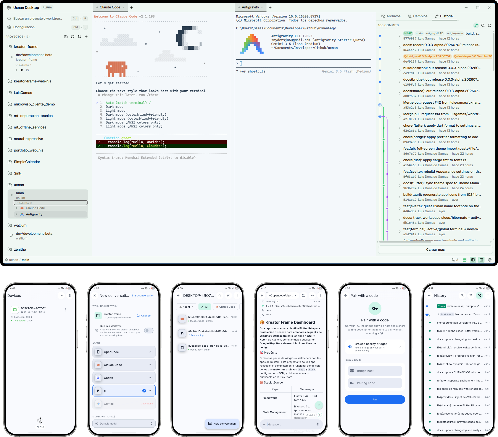

<h1 align="center">Uxnan</h1>

<p align="center">
  
  
  
  
  
</p>

<p align="center">
  <a href="README.es.md"><b>Leer en español</b></a>
</p>

Uxnan (pronounced /uʃ.nan/) is a toolkit I'm building to solve a very specific
problem I have as a developer: **controlling AI coding agents from anywhere,
without my hardware becoming the bottleneck.**

<p align="center">
  
</p>

## Why this project exists

I work with CLI coding agents (Claude Code, Codex CLI, OpenCode, Gemini CLI,
pi-agent) every day. They're extraordinary tools, but the current workflow has
real friction:

- **When I step away from my PC**, I lose all visibility into what the agent is
  doing. I can't check its progress, approve changes, or send new instructions
  from my phone.
- **Existing desktop solutions are excellent**, but many assume high-end
  hardware. On my current setup, running a heavy IDE + multiple agents + an
  Electron environment consumes more resources than I can afford.
- **There's no provider-agnostic mobile tool** that works with any agent, not
  just one in particular.

Uxnan was born to solve exactly that. It's not an agent — it's the **control
plane** for the agents I already use.

## How it fits together

The phone never talks to a cloud middleman in the clear. It pairs with the
**bridge** running on your PC and connects to it **directly first** — over your
LAN or your Tailscale network — and only falls back to an optional, self-hosted
**relay** when you're away from home. Whatever the path, every byte is
end-to-end encrypted; the relay only ever sees sealed envelopes.

```text
   📱 uxnanmobile                  💻 your PC
   (Flutter app)                   ┌──────────────────────────────┐
        │                          │  bridge  ──▶  agent CLIs      │
        │   E2EE (X25519 +         │  (daemon)     claude · codex  │
        ├──── Ed25519 + ──────────▶│               opencode · pi   │
        │     AES-256-GCM)         │               gemini · zero   │
        │                          └──────────────────────────────┘
        │                                      ▲
        └──── relay (optional, ────────────────┘
              self-hosted, off-LAN only —
              forwards sealed envelopes, sees nothing)

   uxnandesktop — a separate, lightweight desktop app to run & review the same
   agents on the PC itself. shared — the contracts both ends speak.
```

## What each component does

Uxnan is a single repository with five projects. Each one has its own README with
the full story; here's the short version and where to go next.

### 📱 `Uxnanmobile` — the mobile app


A Flutter app (Android + iOS) that turns your phone into a remote control for the
agents on your PC. Watch conversations stream in real time, send instructions,
attach images, dictate by voice, review diffs, commit and push, and get a
notification the moment an agent finishes — all over the encrypted, bridge-first
channel.

<a href="https://sink.gamas.workers.dev/uxnan-android">
  
</a>

→ **[Read the mobile app README](uxnanmobile/README.md)**

---

### 🖥️ `Uxnandesktop` — the desktop app


A lightweight **Agent Development Environment** built with Tauri 2, Rust and
Svelte 5. Unlike Electron-based alternatives that consume 200-500 MB of RAM just
by existing, this ADE uses the OS's native webview and targets 30-100 MB of RAM.

The core idea: each task lives in its own git worktree with its own agent running
in an independent pseudoterminal. I can have 5 agents working in parallel without
one blocking another, switch between them with a click (no `git stash`, no `git
checkout`), and review each one's changes in an integrated diff viewer
(CodeMirror 6, unified + side-by-side, hunk-level staging) before committing.

It doesn't integrate any agent's SDK. It's terminal-centric: any CLI agent works
without modification.

<a href="https://github.com/luisgamas/uxnan/releases">
  
</a>

→ **[Read the desktop app README](uxnandesktop/README.md)**

---

### 🌉 `Bridge` — the daemon on your PC


The heart of the product. A small Node.js daemon that runs on your PC, holds the
end-to-end-encrypted connection to your phone (E2EE protocol: X25519 + HKDF +
Ed25519 + AES-256-GCM), and drives the agents on your behalf by launching each
one's **official local CLI** exactly as you would in a terminal. No provider API,
no SDK, no keys: every agent runs under the account you already signed it in
with.

**Real agents wired:** OpenCode, Claude Code, Codex, pi, Gemini CLI, Antigravity, Zero, Grok.

→ **[Read the bridge README](bridge/README.md)**

---

### 🔁 `Relay` — the optional off-LAN hop


A tiny, stateless WebSocket relay you can self-host for when your phone and PC
aren't on the same network. It forwards **sealed E2EE envelopes** and nothing
else — it never sees your code, your diffs, your keys, or a line of plaintext.
Most of the time you won't need it at all.

→ **[Read the relay README](relay/README.md)**

---

### 📦 `Shared` — the common language


The single source of truth for the **JSON-RPC + E2EE contracts** that every part
of Uxnan speaks. The bridge and relay consume it directly; the mobile app keeps
hand-synced Dart equivalents. If two components ever need to agree on a message
shape, they agree here.

- **JSON-RPC**: envelope types + constructors, error codes (`-32000..-32008` +
  standard), typed method registry (build-time-locked to `METHOD_NAMES`).
- **E2EE**: handshake messages, transcript builder, `SecureEnvelope`,
  `PairingPayload` v2 (with `hosts: string[]` for direct addressing).
- **Domain models** (thread/turn/message, git, workspace, project, auth, session,
  approval) and **agent contracts** (`IAgentAdapter`, `AgentCapabilities`,
  `AgentConfig`).
- **Validation**: Ajv-backed validators for requests, responses, E2EE envelopes,
  pairing payloads and push payloads.

→ **[Read the shared contracts README](shared/README.md)**

## Security


Here privacy isn't a feature, it's the foundation. Everything that travels
between the phone and the PC goes through a real end-to-end encrypted channel:
session keys come from an X25519 ephemeral exchange, identities are authenticated
with Ed25519 signatures, and traffic is sealed with AES-256-GCM. The relay, when
it's even involved, is pure transport and never holds a key. Bridge responses are
sanitized too — sign-in status, for example, is reported per agent and **never**
returns a token.

If you find a vulnerability, please don't open a public issue — see
[`SECURITY.md`](SECURITY.md).

## Status

-orange?style=for-the-badge)

Uxnan is in **alpha**, and the core loop already works end to end. From the phone
I can pair with the bridge and hold a real, streaming conversation with **eight
agents** — OpenCode, Claude Code, Codex, pi, Gemini CLI, Antigravity, Zero and Grok — over the
encrypted channel. The desktop app is alpha-functional on its own. Push notifications are
live on Android (iOS depends on Apple assets).

Here's the quick snapshot; the detailed, always-current state for each project
lives in its own `FOR-DEV.md`:

| Project | Where it stands | Details |
|---|---|---|
| [`uxnanmobile/`](uxnanmobile/README.md) | MVP wired, Android alpha-ready; iOS pending Apple assets | [status](uxnanmobile/FOR-DEV.md) |
| [`uxnandesktop/`](uxnandesktop/README.md) | Alpha-functional as a standalone app | [status](uxnandesktop/FOR-DEV.md) |
| [`bridge/`](bridge/README.md) | Implemented; 8 real agents wired | [status](bridge/FOR-DEV.md) |
| [`relay/`](relay/README.md) | Implemented; optional / self-hosted | [status](relay/FOR-DEV.md) |
| [`shared/`](shared/README.md) | Implemented; contracts locked in CI | [README](shared/README.md) |

This is early software, with no users and no production data yet, so things can
still change where a better idea justifies it.

## Support the project

Uxnan is free and open source, built in the open in my own time. If it's useful
to you and you'd like to help it keep moving, a coffee goes a long way — and it's
genuinely appreciated. 🙏

<p align="center">
  <a href="https://sink.gamas.workers.dev/buymeacoffee">
    
  </a>
  <a href="https://sink.gamas.workers.dev/paypal-donations">
    
  </a>
  <a href="https://sink.gamas.workers.dev/github-sponsor">
    
  </a>
</p>

## For contributors & developers

If you want to build, run, or contribute to Uxnan, everything you need lives off
the README so the documentation above stays focused:

- **[`CONTRIBUTING.md`](CONTRIBUTING.md)** — how to set up, the quality gates, and
  how to open a good PR.
- **[`AGENTS.md`](AGENTS.md)** — the single source of truth for conventions,
  architecture rules, and how the docs stay in sync. Read it before any
  non-trivial change.
- **Per-project docs** — each project keeps task-focused guides in its own
  `docs/` and a `CHANGELOG.md`: [`bridge/docs/`](bridge/docs/) ·
  [`relay/docs/`](relay/docs/) · [`uxnanmobile/docs/`](uxnanmobile/docs/) ·
  [`uxnandesktop/docs/`](uxnandesktop/docs/).
- **The specification** — the architecture documents are the source of truth for
  cross-component behavior: [`architecture/`](architecture/00-index.md) (mobile,
  bridge, relay, shared) and
  [`uxnandesktop/architecture/`](uxnandesktop/architecture/00-index.md)
  (desktop).
- **Releases & versioning** — [`VERSIONS.md`](VERSIONS.md).

## License

Uxnan is released under the [Mozilla Public License 2.0](LICENSE).

---

*Uxnan — a name with no relation to, or derivation from, any existing product.*
