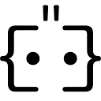
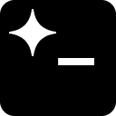

<p align="center">
  
</p>

<h1 align="center">Uxnan</h1>

<p align="center">
  <sub><i>Uxnan — a name with no relation to, or derivation from, any existing product.</i></sub>
</p>

<p align="center">
  <a href="https://github.com/luisgamas/uxnan/releases/latest"></a>
  <a href="LICENSE"></a>
  
</p>

<p align="center">
  English · <a href="README.es.md">Español</a>
</p>

<p align="center">
  <b>Two apps built around one idea: your coding agents shouldn't need your full<br />
  attention, or your most expensive machine, to keep moving.</b>
</p>

<p align="center">
  <b>Uxnan Desktop</b> runs and reviews several CLI coding agents in parallel, each in its own<br />
  git worktree, without the memory cost of a full IDE. <b>Uxnan Mobile</b> pairs with a small<br />
  encrypted daemon on your PC so you can check on an agent, approve its next step, or send<br />
  a new instruction from your phone — across the room or across the world. They're<br />
  independent apps: run Desktop on its own, run Mobile on its own, or run both.
</p>

<p align="center">
  <a href="https://github.com/luisgamas/uxnan/releases/latest">
    
  </a>
  <a href="https://sink.gamas.workers.dev/uxnan-android">
    
  </a>
</p>

<p align="center">
  
</p>

## What it feels like to use

<table>
<tr>
<td width="46%" valign="top">

### Launch any agent into its own worktree
Uxnan Desktop is terminal-centric, so it runs any CLI agent — pick one from the catalog (Claude Code, Codex, OpenCode, Pi, Grok, Antigravity, Zero) or register any other by hand, and it drops straight into an isolated terminal running its own official binary, under your own account. No API keys, no SDKs.

[Agent launch & configuration →](uxnandesktop/docs/agent-launch.md)

</td>
<td width="54%" valign="top">


</td>
</tr>
<tr>
<td width="46%" valign="top">

### Drag a file straight into the terminal
Drag any file or folder from the tree onto a terminal and its path gets typed there — quoted if it needs to be — so an agent never has to guess a path, and neither do you.

[Git, worktrees & the file tree →](uxnandesktop/architecture/02c-git-worktrees.md)

</td>
<td width="54%" valign="top">


</td>
</tr>
<tr>
<td width="46%" valign="top">

### Open a PR without leaving your terminal
Push, pick `base ← head`, and create the PR — uxnan reads the repository's actual branch rules and only offers you the merge methods you're genuinely allowed to use.

[GitHub integration →](uxnandesktop/docs/github.md)

</td>
<td width="54%" valign="top">


</td>
</tr>
<tr>
<td width="46%" valign="top">

### Read your history as a graph
A branch-graph gutter runs next to the commit log — click a commit to expand its changed files, click a file to open just that slice of the diff instead of one giant blob.

[Git, worktrees & diffs →](uxnandesktop/architecture/02c-git-worktrees.md)

</td>
<td width="54%" valign="top">


</td>
</tr>
<tr>
<td width="46%" valign="top">

### Spin up an isolated worktree in seconds
New branch, existing branch, or a custom location — every task gets its own worktree and its own agent, so nothing collides with whatever you're already running.

[Creating worktrees →](uxnandesktop/architecture/02c-git-worktrees.md)

</td>
<td width="54%" valign="top">


</td>
</tr>
<tr>
<td width="46%" valign="top">

### Know your quota before it runs out
Session, weekly and monthly usage for Codex, Claude, Copilot and Grok, read straight from each CLI's own signed-in token — never a pasted key, never a cookie.

[Provider usage stats →](uxnandesktop/docs/providers.md)

</td>
<td width="54%" valign="top">


</td>
</tr>
<tr>
<td width="46%" valign="top">

### Review PRs, issues and CI in full screen
Open a project's Pull Requests, Issues and Actions in a focused view that replaces the center panel — approve, merge, comment or re-run a check without switching apps.

[GitHub integration →](uxnandesktop/docs/github.md)

</td>
<td width="54%" valign="top">


</td>
</tr>
<tr>
<td width="46%" valign="top">

### Watch subagents work under their parent
A subagent from Claude Code, Codex, Grok or OpenCode shows up live as a nested row under the agent that spawned it — with its kind and what it is working on — and the parent won't read "Done" while a child is still working.

[Agent hooks & precise states →](uxnandesktop/docs/agent-hooks.md)

</td>
<td width="54%" valign="top">


</td>
</tr>
</table>

## Also in the box

- **Pets** — an optional animated companion that mirrors what your agents are doing and jumps you to the right terminal when clicked. [docs →](uxnandesktop/docs/pets.md)
- **Automations** — recurring, multi-agent runs that fire on their own schedule, registered with your OS's own scheduler — they work even with uxnan closed. [docs →](uxnandesktop/docs/automations.md)
- **A measured footprint, not a guessed one** — resource mode (Efficient / Balanced / Performance) governs the background work, and the number it's tuned against is benchmarked: **~250 MB** of private memory on Windows 11 (WebView2 150, release build). [resource mode →](uxnandesktop/docs/resource-mode.md) · [benchmark method →](uxnandesktop/docs/resource-benchmarks.md)
- **Quick commands** — shell commands scoped to a project or worktree, with variable substitution, launched from a top-bar shortcut. [details →](uxnandesktop/README.md)
- **Sleep, wake, and pick up where you left off** — an idle workspace's terminals (scrollback included) come back exactly as you left them, and agent CLI sessions auto-resume. [terminal engine →](uxnandesktop/architecture/02b-terminal-engine.md)
- **Multi-agent orchestration** — broadcast one message to several agents at once, or chain them into a durable run with approvals and retries. [docs →](uxnandesktop/docs/orchestration.md)
- **A fully translated interface** — every screen in English and Spanish, not just a handful of strings. [i18n →](uxnandesktop/docs/i18n.md)
- **In-app auto-updates** — stable and nightly channels, downloaded in the background, installed only once your agents are idle. [docs →](uxnandesktop/docs/updates.md)

## Works with any CLI agent

Uxnan Desktop is terminal-centric: if it runs in a terminal, it runs in uxnan —
add any CLI as a custom agent and it launches like any other, no integration
work required. The **22 below report precise state out of the box**: working /
blocked / waiting / done as it happens, plus session auto-resume, live model
discovery, and per-agent run options.

<p align="center">
  <kbd> Claude Code</kbd>
  <kbd><picture><source media="(prefers-color-scheme: dark)" srcset="assets/agents/codex-on-dark.svg" /></picture> Codex</kbd>
  <kbd> OpenCode</kbd>
  <kbd> Cursor</kbd>
  <kbd> GitHub Copilot</kbd>
  <kbd> Droid</kbd>
  <kbd> Grok</kbd>
  <kbd> Amp</kbd>
  <kbd> Goose</kbd>
  <kbd> Qwen Code</kbd>
  <kbd> Kiro</kbd>
  <kbd> Auggie</kbd>
  <kbd> Devin</kbd>
  <kbd> Kimi</kbd>
  <kbd> Kilo Code</kbd>
  <kbd> MiMo Code</kbd>
  <kbd> Command Code</kbd>
  <kbd><picture><source media="(prefers-color-scheme: dark)" srcset="assets/agents/openclaude-on-dark.svg" /></picture> OpenClaude</kbd>
  <kbd> Pi</kbd>
  <kbd> OMP</kbd>
  <kbd> Zero</kbd>
  <kbd> Antigravity</kbd><sup>*</sup>
</p>

<p align="center">
  <sub>*Antigravity's integration is partial — it runs one-shot per turn with no live approval channel.<br />
  Zero has no hook surface; its state is read from the session it writes to disk.</sub>
</p>

These nine are in the catalog too. They launch, run and show a working / idle
indicator like anything else — their CLI simply exposes no way to say a turn
**ended**, so uxnan doesn't claim a precise state it cannot know. Point one at
the bundled wrapper and you get `working` on launch and `done` on exit.

<p align="center">
  <kbd> Aider</kbd>
  <kbd> Cline</kbd>
  <kbd> Continue</kbd>
  <kbd> Crush</kbd>
  <kbd> Codebuff</kbd>
  <kbd> Mistral Vibe</kbd>
  <kbd> Rovo Dev</kbd>
  <kbd> Autohand</kbd>
  <kbd> Ante</kbd>
  <kbd>+ any CLI agent</kbd>
</p>

<p align="center">
  <sub>Using one of these? If its CLI grows a hook surface, wiring it is a single table row —<br />
  see <a href="uxnandesktop/docs/agent-hooks.md">agent hooks</a>, and send a pull request.</sub>
</p>

<p align="center">
  Every one of them runs as that vendor's own official local CLI, under the account or<br />
  subscription you already signed it in with — uxnan doesn't call a provider API, hold a key,<br />
  or embed an SDK. It just drives the terminal, exactly like you would.<br />
  <b>Seven of them — Claude Code, Codex, OpenCode, Pi, Grok, Antigravity and Zero — are what Uxnan Mobile drives from your phone.</b>
</p>

---

## Uxnan Mobile — your agents, in your pocket

<!-- image added manually by the maintainer -->
<p align="center">
  
</p>

It's a real client, not a status page: conversations carry a **name the agent
wrote** rather than the first words you typed, they **stream in live** and survive
navigating away and back, a **message queue** lets you send follow-ups while an
agent is still working — reaching it *mid-turn*, without stopping it, on the
agents whose CLI allows that — you can attach **images**, pick the **agent and model**
per conversation, see protocol-confirmed **context compactions**, and keep every
native progress/final response without losing earlier text (settled progress folds
under **N previous messages**). You can also review and stage a **Git diff** and
get a **push notification** the moment an agent finishes — all over the same
end-to-end encrypted channel the bridge speaks. Mobile offers the seven active
agents shown above.

**Status: Android is alpha-ready.** iOS is written but not yet shipped — it's
waiting on Apple developer assets the project doesn't have yet.

### How it connects

Uxnan Mobile does **not** pair with Uxnan Desktop. It pairs with **`uxnan-bridge`**,
a small daemon that runs on your PC on its own — you don't need Desktop installed
at all to use Mobile, or vice versa:

```bash
npm install -g uxnan-bridge
uxnan-bridge start
```

That boots the daemon and prints the pairing QR right there in the terminal.
Scan it from the app (or type the short code it prints) and you're paired. The
phone connects **directly** over your LAN or Tailscale first, and only falls back
to an optional, self-hosted relay when you're off that network — either way, every
byte is sealed end-to-end before it leaves your phone. Full setup in
**[bridge/README.md](bridge/README.md)**.

---

## Install

### Uxnan Desktop

Grab the latest release for your platform from
**[GitHub Releases](https://github.com/luisgamas/uxnan/releases/latest)**:

| Platform | What to grab |
|---|---|
| Windows | the `.msi`, or the NSIS `_x64-setup.exe` installer |
| macOS *(experimental, unsigned)* | `_x64.dmg` (Intel) or `_aarch64.dmg` (Apple Silicon) |
| Linux | `.deb`, `.AppImage`, or `.rpm` |

Honest heads-up: the Windows installers aren't code-signed yet, so SmartScreen
will warn on first run (**More info → Run anyway**), and the macOS builds are
unsigned and unnotarized, so Gatekeeper blocks them until you authorize the app
once by hand — see the **[macOS install guide](uxnandesktop/docs/install-macos.md)**.
That's the state of an alpha project without a paid signing certificate yet, not
a sign anything is wrong. Prefer to build it yourself? See
**[building from source](uxnandesktop/docs/build.md)**.

### Uxnan Mobile

<p>
  <a href="https://sink.gamas.workers.dev/uxnan-android">
    
  </a>
</p>

Android is on **[Google Play, open testing](https://sink.gamas.workers.dev/uxnan-android)**.
iOS isn't published yet, but the code is there — it's a Flutter project, so you
can build and run it yourself on your own Mac (see
**[uxnanmobile/README.md → Getting started](uxnanmobile/README.md#getting-started)**).
Heads-up: push notifications may not work on a self-built iOS app, since the
APNs signing credentials aren't included in the repo.

### The bridge (only if you want Mobile)

```bash
npm install -g uxnan-bridge
```

See **[bridge/README.md](bridge/README.md)** for the full CLI, autostart, and
per-agent sign-in prerequisites.

---

## Security

Every byte between your phone and your PC is sealed end-to-end — an X25519 key
exchange, Ed25519-signed identities, and AES-256-GCM encryption; the optional
relay only ever sees sealed envelopes, never your code. GitHub actions route
through your own `gh` CLI, which keeps its OAuth token in your OS keychain —
uxnan reads a sanitized login status and nothing else. Found a vulnerability?
Please don't open a public issue — see **[SECURITY.md](SECURITY.md)**.

## Support the project

Uxnan is free, open source, and built in my own time. If it's useful to you, a
star tells me people are actually using this — and a coffee genuinely helps keep
it moving. 🙏

<p align="center">
  <a href="https://sink.gamas.workers.dev/buymeacoffee">
    
  </a>
  <a href="https://sink.gamas.workers.dev/paypal-donations">
    
  </a>
  <a href="https://sink.gamas.workers.dev/github-sponsor">
    
  </a>
</p>

## Contributing

Want to build, run, or contribute to Uxnan? Start with
**[CONTRIBUTING.md](CONTRIBUTING.md)** for setup and quality gates, and
**[AGENTS.md](AGENTS.md)** — the single source of truth for conventions and
architecture rules. Each component also keeps its own `README.md`, `docs/`, and
`CHANGELOG.md`: [`uxnandesktop/`](uxnandesktop/README.md) ·
[`uxnanmobile/`](uxnanmobile/README.md) · [`bridge/`](bridge/README.md) ·
[`relay/`](relay/README.md) · [`shared/`](shared/README.md).

## License

Uxnan is released under the [Mozilla Public License 2.0](LICENSE).
