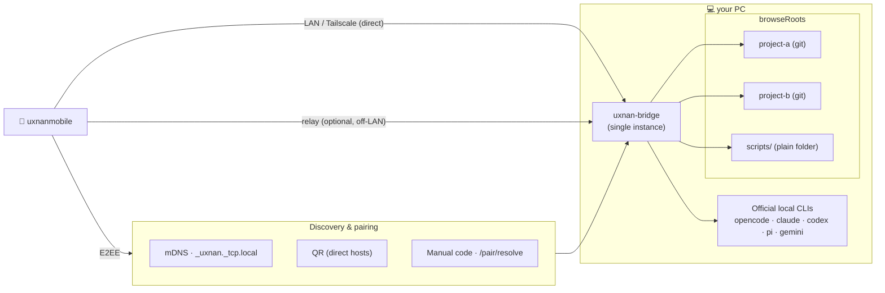

# uxnan-bridge


The local control-plane daemon that connects the [Uxnan](../README.md) mobile app
to your PC over an end-to-end-encrypted channel. It is the **heart of the
product**: it holds the secure connection to your phone, runs Git and reads your
workspace on request, and drives the AI coding agents on your behalf, routing
JSON-RPC methods to per-domain handlers.

The product is **bridge-first**. The mobile app pairs with the bridge and tries
its direct LAN / Tailscale addresses first; the [relay](../relay/README.md) is an
optional, self-hosted off-LAN fallback. Background push notifications are sent
**by the bridge itself** (FCM HTTP v1) over any transport, so the phone keeps
receiving them whether it reached the bridge directly or through a relay.

> **Status:** alpha-functional on the primary path (LAN/Tailscale-direct,
> bridge-direct push), with **five real agents wired**. The detailed breakdown of
> what is built and what remains lives in [`FOR-DEV.md`](FOR-DEV.md); the release
> history is in [`CHANGELOG.md`](CHANGELOG.md).

## Why the bridge matters

The bridge is small on purpose, but it is where the design decisions that make
Uxnan distinct actually live:

- **One bridge, many projects.** You start the bridge **once**, from a single
  location of your choosing, and it gives the phone access to **all** the projects
  underneath it — Git repositories or plain folders alike. There is no need to
  launch a separate process per project: the phone browses the configured roots
  (`workspace/browseDirs`, constrained by the `browseRoots` setting) and roots a
  new conversation anywhere it is allowed to look.
- **Provider-agnostic, with no keys to hand over.** For each agent the bridge
  spawns that agent's **official local CLI** and talks to it over stdio. It never
  uses a provider HTTP API, API key, or language SDK. Each CLI runs under the
  account or subscription you already authenticated on the machine, and the bridge
  only orchestrates it.
- **Effortless discovery.** A freshly started bridge advertises itself on the
  local network over mDNS (`_uxnan._tcp.local`), so the phone can find it without
  typing an address. Pairing is by QR (which carries the bridge's direct
  `host:port` list) or by a short manual code (`GET /pair/resolve?code=`) when a
  camera is not convenient.
- **The transports it brings up.** On start, the bridge runs a direct LAN
  `http + ws` server (which also serves Tailscale addresses transparently) and,
  optionally, maintains a relay pairing session for off-LAN reach. The phone
  chooses the best available path; you do not have to.
- **End-to-end encryption is not optional.** Every byte to and from the phone is
  sealed with the documented E2EE protocol (X25519 + HKDF + Ed25519 +
  AES-256-GCM). Responses are sanitized before they leave the machine — for
  example, `auth/status` reports sign-in per agent and **never** returns a token.

<details>
<summary><b>Diagram — one bridge serving many projects over several transports</b></summary>



</details>

## How the bridge drives agents

This is the mechanism behind "provider-agnostic": the bridge spawns each agent's
official local CLI — `opencode`, `claude`, `codex`, `pi`, `gemini` — as a child
process and drives it over stdio, exactly as you would in a terminal. Prompts are
passed as `argv` elements with `shell:false` (no shell injection), in the thread's
working directory. The bridge parses each CLI's native stream and re-emits it as
structured events — `stream/content/block` (command / diff / tool) plus
`stream/thinking/delta` (reasoning) — so the phone renders the same shape no
matter which agent is running.

See [`FOR-HUMAN.md`](FOR-HUMAN.md) for the per-agent install / login
prerequisites, and [`docs/agents.md`](docs/agents.md) for the details.

## Install

```bash
npm install -g uxnan-bridge   # (planned — published as a global package)
```

## CLI

```bash
uxnan-bridge start            # start the daemon: LAN server + (optional) relay pairing session
uxnan-bridge status           # print current status as JSON
uxnan-bridge qr               # print the pairing QR in the terminal (with the manual code)
uxnan-bridge code             # print just the current pairing code
uxnan-bridge stop             # stop the running daemon (via the lock file)
uxnan-bridge install-service  # autostart at logon (Task Scheduler / LaunchAgent / systemd --user)
uxnan-bridge uninstall-service
```

Logs are written to `~/.uxnan/logs/bridge-YYYY-MM-DD.log` (daily rotation, with a
secret-redaction pass) and to stderr. Autostart at login is configured by the
platform scripts under `scripts/`.

The Ed25519 identity is stored in the OS keychain (Windows Credential Manager /
macOS Keychain / Linux Secret Service) via `@napi-rs/keyring`. With no keychain
available, the bridge still runs with an in-memory identity (not persisted across
restarts).

## Docs

Task-focused guides live in [`docs/`](docs/):
[installation & autostart](docs/installation.md) ·
[configuration](docs/configuration.md) ·
[connectivity (LAN / Tailscale / relay)](docs/connectivity.md) ·
[how agents are driven](docs/agents.md) ·
[testing](docs/testing.md) ·
[packaging & deploy](docs/deploy.md) ·
[push notifications](docs/push-notifications.md).

## Architecture

- **Contracts.** Consumes [`@uxnan/shared`](../shared/README.md) for JSON-RPC and
  E2EE types and runtime validators. The bridge exposes **61 JSON-RPC methods +
  8 streaming notifications** (see `shared/src/jsonrpc/`); the mobile app keeps
  manually-synced Dart equivalents of the same shapes.
- **State.** Non-secret JSON under `~/.uxnan/` (atomic writes) —
  `daemon-config.json`, `pairing-session.json`, `threads.json`,
  `trusted-phones.json`, `push-state.json`, `agent-cache/`, `logs/`. The Ed25519
  identity is a secret kept in a `SecretStore`, never written in plaintext.
- **Routing.** `HandlerRouter.dispatchRaw()` validates the envelope and routes to
  registered handlers; errors map to JSON-RPC error codes (`-32000..-32008` +
  standard).
- **Agents.** An `IAgentAdapter` per agent (OpenCode / Claude Code / Codex / pi /
  Gemini CLI); `AgentManager` orchestrates streaming and broadcasts `stream/*`
  notifications to connected phones.
- **Push.** `PushService` (persisted by relay `sessionId`) delivers FCM HTTP v1
  directly via `createBridgePushSender` (lazy `firebase-admin`), with the relay
  `/push/notify` as a fallback.

The cross-component specification is `architecture/02a-system-architecture.md`
§5.8 and
[`uxnandesktop/architecture/02e-bridge-integration.md`](../uxnandesktop/architecture/02e-bridge-integration.md).

## Develop

```bash
# from the repo root (npm workspaces):
npm run build      # build @uxnan/shared then uxnan-bridge
npm test           # build + run all node:test suites
npm run typecheck  # tsc --noEmit across packages
npm run format     # prettier --write
```

Requires Node ≥ 18. ESM-only. The test runner uses `--test-concurrency=1` on
Windows (see [`CHANGELOG.md`](CHANGELOG.md) for why). What is implemented versus
still pending — including the recipe for wiring the next agent — is tracked in
[`FOR-DEV.md`](FOR-DEV.md).
