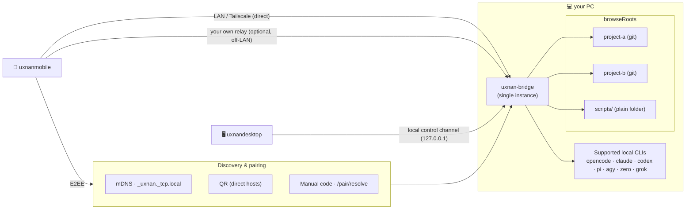

# uxnan-bridge


The local control-plane daemon behind [Uxnan](../README.md). It connects Uxnan
Mobile to your PC over an end-to-end-encrypted channel, and serves Uxnan Desktop
on the same machine over a local control channel. It is the **heart of the
product**: it holds the secure connection to your phone, runs Git and reads your
workspace on request, and drives the AI coding agents on your behalf, routing
JSON-RPC methods to per-domain handlers.

The product is **bridge-first**. The mobile app pairs with the bridge and tries
its direct LAN / Tailscale addresses first; for a phone on another network the
bridge can deploy **your own [relay](../relay/README.md)** into your free
Cloudflare account (`uxnan-bridge relay setup`) — optional, off until you set it
up. Background push notifications are sent
**by the bridge itself** (FCM HTTP v1) over any transport, so the phone keeps
receiving them whether it reached the bridge directly or through a relay.

> **Status:** alpha-functional on the primary path (LAN/Tailscale-direct,
> bridge-direct push), with **seven active real agents wired**. The detailed breakdown of
> what is built and what remains lives in [`FOR-DEV.md`](FOR-DEV.md); the release
> history is in [`CHANGELOG.md`](CHANGELOG.md).

## Why the bridge matters

The bridge is small on purpose, but it is where the design decisions that make
Uxnan distinct actually live:

- **One bridge, one list of projects, every client a mirror.** The bridge keeps
  the only registry of projects and the only record of every conversation;
  the phone and Uxnan Desktop converge on it by revision (`sync/changes`), so a
  project or a conversation started on one appears on the other — including
  everything done on the phone before the desktop ever connected. New projects
  are explored from one start folder (`home`) you set once, whatever
  directory the bridge was started in.
- **New worktrees land where the desktop puts them.** `git/createWorktree` takes
  no path from the phone any more: the bridge places the worktree itself, under
  `~/uxnan/worktrees/<project>/<branch>` by default — the same layout
  `uxnandesktop` resolves — so one repository's checkouts stay grouped whichever
  app created them. Configurable per install (`worktrees` in
  [`docs/configuration.md`](docs/configuration.md)), and existing worktrees are
  never moved.
- **Conversation links follow the agent across worktrees.**
  `workspace/resolveFileLink` canonicalizes a local path cited in a response.
  Relative paths start at the conversation cwd; an absolute or `..` path can
  select a sibling Git worktree as the viewer root. Only an existing regular
  file is returned, and `.git` plus sensitive path segments remain denied.
- **Provider-agnostic, with no keys to hand over.** For each agent the bridge
  spawns that agent's **official local CLI** and talks to it over stdio. It never
  uses a provider HTTP API, API key, or language SDK. Each CLI runs under the
  account or subscription you already authenticated on the machine, and the bridge
  only orchestrates it.
- **Effortless discovery.** A freshly started bridge advertises itself on the
  local network over mDNS (`_uxnan._tcp.local`), so the phone can find it without
  typing an address. Pairing is by QR (which carries the bridge's direct
  `host:port` list) or by a short manual code (`GET /pair/resolve?code=`) when a
  camera is not convenient. Multi-homed PCs advertise explicitly through each
  eligible IPv4 interface instead of trusting the OS multicast route. Discovery
  is not authorization: the pairing code is never advertised, choosing a result
  only fills the host, and the normal operator-gated E2EE enrollment still runs.
- **The transports it brings up.** On start, the bridge runs a direct LAN
  `http + ws` server (which also serves Tailscale addresses transparently) and,
  when you have set one up, keeps a control socket open to your own relay so a
  phone on any network can reach it. The relay is a shared setting, so a phone
  paired at home learns it without pairing again. The phone chooses the best
  available path; you do not have to.
- **End-to-end encryption is not optional.** Every byte to and from the phone is
  sealed with the documented E2EE protocol (X25519 + HKDF + Ed25519 +
  AES-256-GCM). Responses are sanitized before they leave the machine — for
  example, `auth/status` reports sign-in per agent and **never** returns a token.

<details>
<summary><b>Diagram — one bridge serving many projects over several transports</b></summary>


```mermaid
flowchart LR
  phone["📱 uxnanmobile"]
  desktop["🖥️ uxnandesktop"]

  subgraph disc["Discovery & pairing"]
    mdns["mDNS · _uxnan._tcp.local"]
    qr["QR (direct hosts)"]
    code["Manual code · /pair/resolve"]
  end

  subgraph pc["💻 your PC"]
    bridge["uxnan-bridge<br/>(single instance)"]
    subgraph roots["browseRoots"]
      p1["project-a (git)"]
      p2["project-b (git)"]
      p3["scripts/ (plain folder)"]
    end
    clis["Supported local CLIs<br/>opencode · claude · codex · pi · agy · zero · grok"]
  end

  phone -- "E2EE" --> disc
  disc --> bridge
  phone -- "LAN / Tailscale (direct)" --> bridge
  phone -- "your own relay (optional, off-LAN)" --> bridge
  desktop -- "local control channel (127.0.0.1)" --> bridge
  bridge --> p1
  bridge --> p2
  bridge --> p3
  bridge --> clis
```

</details>

## How the bridge drives agents

This is the mechanism behind "provider-agnostic": the bridge spawns each supported
agent's official local CLI — `opencode`, `claude`, `codex`, `pi`, `agy`, `zero`, `grok` — as a
child process and drives it over stdio, exactly as you would in a terminal (Zero is
driven over the Agent Client Protocol, `zero acp`). Prompts are
passed as `argv` elements with `shell:false` (no shell injection), in the thread's
working directory — except Claude Code, whose prompt travels on an open stdin
pipe (`--input-format stream-json`) so a follow-up can reach it mid-turn.
The bridge parses each CLI's native stream and re-emits it as
structured events — `stream/content/block` (command / diff / tool) plus
`stream/thinking/delta` (reasoning) — so the phone renders the same shape no
matter which agent is running.

Codex, Claude and pi also emit durable assistant-response boundaries. The
bridge reconciles terminal payloads additively, preserving every progress and
final message in native order instead of replacing the turn with its last item.

The conversation is also shared with the agent's own clients. On every idle
`turn/list`, the bridge merges completed native-session turns that were written
outside Uxnan: Codex Desktop/CLI, OpenCode Desktop, Claude Code, pi, Zero and
Grok are supported. Existing bridge turns remain authoritative and are linked
rather than duplicated. OpenCode is read through its official local server API;
the others use their persisted session logs. Antigravity is the explicit gap:
`agy` exposes neither a readable transcript nor a history export, so no history
is inferred from its opaque database.

Any agent session can also become a conversation, and a session has one writer
at a time:

- **Sessions in a folder.** `agent/sessions` lists each agent's own sessions in
  a folder (started in a terminal, in the agent's app or by the bridge), and
  `thread/start` with `agentSessionId` continues one. Antigravity cannot list
  its sessions. A conversation keeps its native session across a bridge restart
  or self-update, for all seven agents.
- **A terminal holds its session.** Uxnan Desktop tells the bridge which
  sessions its terminals have open (`agent/hold` / `agent/release`, local channel
  only). The bridge refuses turns in a held session (`-32010 SessionHeld`) and
  announces each change (`stream/agent/held`); any client can ask for a held
  session with `agent/requestHandoff`. See
  [`architecture/02a` §5.8.19](../architecture/02a-system-architecture.md).

The standalone Gemini CLI is intentionally unsupported. Antigravity (`agy`) is
the active Google integration.

See [`FOR-HUMAN.md`](FOR-HUMAN.md) for the per-agent install / login
prerequisites, and [`docs/agents.md`](docs/agents.md) for the details.

## Install

```bash
npm install -g uxnan-bridge
```

## CLI

```bash
uxnan-bridge start            # start the daemon: LAN server + your relay, if set up
uxnan-bridge status           # the running bridge's status as JSON (asks it; starts nothing)
uxnan-bridge qr               # print the pairing QR — the running bridge's (the service's) when one runs
uxnan-bridge code             # print just the pairing code — the running bridge's when one runs
uxnan-bridge stop             # stop the running daemon (via the lock file)
uxnan-bridge install-service  # run as your user's service (Task Scheduler / LaunchAgent / systemd --user)
uxnan-bridge uninstall-service
uxnan-bridge service-status   # installed / running, as JSON (Uxnan Desktop reads it)
uxnan-bridge service-start    # start the installed service
uxnan-bridge config get       # shared settings; `config set home <folder>` / `config set name <name>`
uxnan-bridge relay setup --account <id> [--remember]  # deploy your own relay to Cloudflare (token prompted)
uxnan-bridge relay status     # also: use <wss-url> · enable · disable · update · rotate · remove [--delete-worker]
uxnan-bridge update           # ask the running bridge to update itself
uxnan-bridge version          # print the installed version (starts nothing)
```

**Pairing is time-boxed.** A first-time enrollment is only accepted while a
pairing window is open, so a device that never saw your screen can't enroll
itself over the LAN or through your relay. The window opens for 5 minutes
whenever you show the QR or the code — and also when a phone successfully looks
up the code. Showing the QR also gives your relay a one-time ticket, so a phone
on another network can pair by scanning it. Against a
daemon started by `install-service`, `uxnan-bridge qr` and `uxnan-bridge code`
ask that running bridge over its local control channel for its own QR or code,
which opens *its* window, so a scan or a typed code pairs with the service.
With no bridge answering, `code` prints the code every bridge shares
(`~/.uxnan/pairing-code.json`), which the next one started accepts.
Already-paired devices reconnect at any time and are never affected.

Logs are written to `~/.uxnan/logs/bridge-YYYY-MM-DD.log` (daily rotation, with a
secret-redaction pass) and to stderr. Autostart at login is configured by the
platform scripts under `scripts/`.

The bridge is the ecosystem's core engine, so `start`/`qr`/`code` also
print a one-line **"a newer bridge is available"** notice to stderr when the
running version is behind the latest published to npm (`latest` dist-tag). The
check is best-effort; the short commands keep a 24h cache
(`~/.uxnan/update-check.json`), while the **running bridge checks every hour**
and tells every client (`stream/bridge/updated`, `bridge/status` → `update`).
Run as your service, **the bridge updates itself** when any client asks
(`bridge/update`, never under a running turn): it installs the published version
and restarts on it — see [`docs/installation.md`](docs/installation.md) →
*Staying up to date*.

The Ed25519 identity is stored in the OS keychain (Windows Credential Manager /
macOS Keychain / Linux Secret Service) via `@napi-rs/keyring`. With no keychain
available, the bridge still runs with an in-memory identity (not persisted across
restarts).

## Docs

Task-focused guides live in [`docs/`](docs/):
[installation & autostart](docs/installation.md) ·
[configuration](docs/configuration.md) ·
[connectivity (LAN / Tailscale / relay)](docs/connectivity.md) ·
[how agents are driven](docs/agents.md) (start at *Drive surface*) ·
[testing](docs/testing.md) ·
[packaging & deploy](docs/deploy.md) ·
[push notifications](docs/push-notifications.md).

## Architecture

- **Contracts.** Consumes [`@uxnan/shared`](../shared/README.md) for JSON-RPC and
  E2EE types and runtime validators. The bridge exposes **101 JSON-RPC methods +
  25 streaming notifications** (see `shared/src/jsonrpc/`); the mobile app keeps
  manually-synced Dart equivalents of the same shapes.
- **State.** Non-secret JSON under `~/.uxnan/` (atomic writes) —
  `daemon-config.json` (incl. the `relay` endpoint), `relay.json` (how the relay
  was set up), `pairing-session.json`, `threads/<threadId>.json`,
  `metrics.json`,
  `trusted-phones.json`, `push-state.json`, `update-check.json`, `agent-cache/`,
  `agent-processes.json` (the agent processes the running bridge started, so the
  next one can end those a hard-killed bridge left behind), `logs/`. `metrics.json` is the complete historical activity ledger; it keeps
  five rotating `.bak1` … `.bak5` generations and is not pruned when a thread is
  deleted. The Ed25519 identity and metrics sealing key are secrets kept in a
  `SecretStore`, never written in plaintext — as is a Cloudflare token, and only
  when you asked to remember it.
- **Routing.** `HandlerRouter.dispatchRaw()` validates the envelope and routes to
  registered handlers; errors map to JSON-RPC error codes (`-32000..-32010` +
  standard).
- **Agents.** An `IAgentAdapter` per agent (OpenCode / Claude Code / Codex / pi /
  Antigravity / Zero / Grok); `AgentManager` orchestrates streaming and broadcasts `stream/*`
  notifications to every connected client (phones and desktops).
- **Relay.** `relay/relay-service.ts` is the one owner of your relay: it deploys
  it (`relay/cloudflare.ts`, Cloudflare's REST API), keeps the control socket
  (`relay/relay-host.ts`: 30 s keepalive, 2 s → 60 s reconnect backoff, one
  channel per phone) and answers `relay/*` for every client. Each phone channel
  runs the same secure session as the LAN, behind the same pairing window.
- **Push.** `PushService` (persisted by secure-session `sessionId` in
  `push-state.json`) delivers FCM HTTP v1 directly via `createBridgePushSender`
  (lazy `firebase-admin`) — the only push path: the token goes nowhere but FCM,
  and without a Firebase service account background push is off.

The cross-component specification is `architecture/02a-system-architecture.md`
§5.8 and
[`uxnandesktop/architecture/02e-bridge-integration.md`](../uxnandesktop/architecture/02e-bridge-integration.md).

## Develop

```bash
# from the repo root (npm workspaces):
npm run build      # build @uxnan/shared then uxnan-bridge
npm test           # build + run all node:test suites
npm run typecheck  # tsc --noEmit across packages
npm run format     # prettier --write
```

Requires Node ≥ 18. ESM-only. The test runner uses `--test-concurrency=1` on
Windows (see [`CHANGELOG.md`](CHANGELOG.md) for why). What is implemented versus
still pending — including the recipe for wiring the next agent — is tracked in
[`FOR-DEV.md`](FOR-DEV.md).
