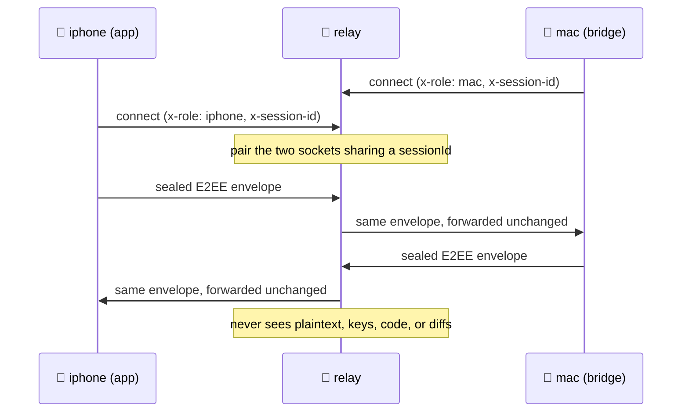

# uxnan-relay


A small, stateless WebSocket relay that forwards **opaque E2EE envelopes** between
the [Uxnan](../README.md) mobile app and the [bridge](../bridge/README.md) when
the two aren't on the same network. It only ever sees encrypted frames — never
plaintext, keys, code, or diffs. The envelope-forwarding path is stateless; the
**optional** push fallback persists a small token/dedupe file
(`~/.uxnan/relay-state.json`).

> **Status:** alpha-functional — and **optional / self-hosted**. The product is
> bridge-first (LAN-direct and Tailscale-direct need zero hosting and zero
> credentials); the relay is just the hosted off-LAN fallback for people who want
> to run their own. Push notifications are sent **by the bridge directly** now —
> the relay's `/push/*` endpoints stay only as a fallback. What's built and
> what's left is in [`FOR-DEV.md`](FOR-DEV.md); history in
> [`CHANGELOG.md`](CHANGELOG.md).

> **`mac` / `iphone` are ROLES, not platforms.** `mac` = the PC/bridge side (runs
> on Windows, macOS or Linux); `iphone` = the mobile app side (Android or iOS).
> The names come from the protocol spec and are fixed by the wire contract with
> the mobile app — they do not restrict the operating system.

## When you actually need it

Most of the time, you do not. When your phone and PC share a network — the same
Wi-Fi, or a Tailscale tailnet — the app reaches the bridge **directly**, with no
relay, no hosting, and no credentials. The relay exists for the one case the
direct paths cannot cover: reaching your PC from **outside** that network. In that
case you self-host this relay, and it simply shuttles sealed envelopes between the
two sides. Because everything is already end-to-end encrypted, the relay is a dumb
pipe by design — it can route or drop traffic, but it can never read it.

<details>
<summary><b>Diagram — how the relay pairs two sides by session, seeing nothing</b></summary>



</details>

## Run

```bash
uxnan-relay 8787        # or: RELAY_PORT=8787 uxnan-relay
```

## Protocol

A client connects via WebSocket presenting:

| Header | Query fallback | Values |
|---|---|---|
| `x-role` | `?role=` | `mac` (bridge) or `iphone` (app) |
| `x-session-id` | `?sessionId=` | the shared session id |

The relay pairs the `mac` and `iphone` sockets that share a `sessionId` and
forwards every frame from one to the other unchanged. `GET /health` returns
`{"ok":true}`. The full cross-component spec is
`architecture/02a-system-architecture.md` §5.10.

## Docs

See [`docs/`](docs/): [deployment & hosting](docs/deploy.md) (LAN-only vs
Cloudflare Tunnel / Fly.io / Workers) · [testing](docs/testing.md).

Push notifications are **bridge-first** now (the relay is only an optional
delivery fallback) — see
[`bridge/docs/push-notifications.md`](../bridge/docs/push-notifications.md).

## Develop

```bash
# from the repo root (npm workspaces):
npm run build && npm test
```

Requires Node ≥ 18. ESM-only. The relay consumes
[`@uxnan/shared`](../shared/README.md) for the JSON-RPC envelope types; the
bridge-side `relay-e2e.test.ts` exercises the full end-to-end (relay + bridge + a
fake phone over a real WebSocket).
