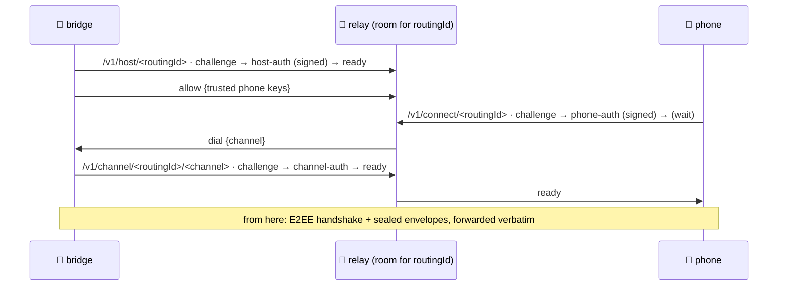

# uxnan-relay


The relay lets the [Uxnan](../README.md) phone app reach your PC's
[bridge](../bridge/README.md) from **another network** — mobile data, a café, the
office — without a VPN. It is a **Cloudflare Worker with one SQLite-backed
Durable Object per bridge**, and it runs in **your own free Cloudflare account**:
the bridge deploys it there for you (`uxnan-bridge relay setup`). Uxnan hosts no
relay and has no server in the path.

The relay first checks who is connecting — the bridge and each phone sign a
challenge with their Ed25519 identity key — then turns into a blind pipe. Every
byte after that is the documented E2EE handshake and AES-256-GCM envelopes,
which the relay cannot read. Uxnan Desktop never uses it: it talks to the bridge
on the same machine over the local control channel.

> **Status:** alpha-functional — the relay, the bridge's deploy and control
> (`relay/*`, `uxnan-bridge relay …`) and the phone's relay client are built and
> tested against the real Workers runtime and a relay deployed to Cloudflare.
> Still optional: LAN and Tailscale need no relay at all. The desktop and phone
> screens for it are not built yet (the CLI is the way in today). Details in
> [`FOR-DEV.md`](FOR-DEV.md); history in [`CHANGELOG.md`](CHANGELOG.md).

## When you need it

Most of the time, you do not. When the phone and the PC share a network — the
same Wi-Fi, or a Tailscale tailnet — the phone reaches the bridge **directly**,
and it always tries those addresses first. The relay covers the one case the
direct paths cannot: a phone on another network with no VPN. The user guide is
[`docs/connecting.md`](../docs/connecting.md).

## How a user gets one

Through the bridge, never by hand:

```bash
uxnan-bridge relay setup --account <cloudflare-account-id>   # asks for an API token
```

The bridge uploads the Worker it ships into that account, adds its own public
key to the Worker's `UXNAN_HOST_KEYS`, enables `workers.dev`, and from then on
keeps a control socket open to it. Paired phones learn the relay through the
bridge's shared settings and use it when no direct address answers. The token
is used for the deploy and dropped unless `--remember` keeps it in the system
keyring. Full flow, token permissions and the manual path for developers:
[`docs/deploy.md`](docs/deploy.md).

## How it works


```mermaid
sequenceDiagram
  participant B as 🌉 bridge
  participant R as 🔁 relay (room for routingId)
  participant P as 📱 phone
  B->>R: /v1/host/<routingId> · challenge → host-auth (signed) → ready
  B->>R: allow {trusted phone keys}
  P->>R: /v1/connect/<routingId> · challenge → phone-auth (signed) → (wait)
  R->>B: dial {channel}
  B->>R: /v1/channel/<routingId>/<channel> · challenge → channel-auth → ready
  R->>P: ready
  Note over P,B: from here: E2EE handshake + sealed envelopes, forwarded verbatim
```

- **Routes.** `/v1/host/<routingId>` (the bridge's control socket),
  `/v1/connect/<routingId>` (a phone), `/v1/channel/<routingId>/<channelId>`
  (the bridge's side of one phone's pipe), and `GET /v1/version`
  (`{ name, protocol, version }`). Anything else is `404`; a route opened
  without a WebSocket upgrade is `426`.
- **Auth.** On every socket the relay sends a challenge nonce; the client signs
  `relaySigningMessage` — route, relay host, routing id, channel id and nonce —
  with its Ed25519 key, so a signature cannot be replayed on another route,
  relay or channel. A host key must be in the Worker's `UXNAN_HOST_KEYS`, and
  the first host that claims a routing id keeps it. A phone must be on the
  bridge's allow list (`allow` frame) or present a one-time pairing ticket.
- **Pairing tickets.** When you show the pairing QR, the bridge sends the relay
  the SHA-256 of a fresh 32-byte ticket with a time-to-live (`ticket`, at most
  15 minutes; the bridge uses its pairing window). The QR carries the ticket;
  the relay admits one phone presenting it, once, then forgets it. The E2EE
  handshake behind it is still gated on the bridge's pairing window.
- **Revocation.** Removing a trusted phone resends the allow list; the relay
  closes that phone's live channel at once (`revoked`, 4010).
- **Several phones.** Each phone gets its own channel; the bridge runs the same
  secure session over each as on the LAN.
- **Several PCs.** One Worker per Cloudflare account serves every PC set up on
  it: each PC adds its key to `UXNAN_HOST_KEYS` and has its own room.
- **Idle costs nothing.** The room uses the WebSocket Hibernation API: between
  messages it is evicted from memory, its sockets stay open, and the bridge's
  30-second `ping` is answered `pong` by the runtime without waking it. Per-socket
  state lives in hibernation attachments and the room's SQLite storage.
- **What it stores.** The bound host key, the trusted phone keys, and the
  SHA-256 of any open ticket — nothing from the traffic.
- **Limits.** Control frames ≤ 64 KiB; ≤ 64 trusted phone keys; ≤ 8 phones
  connected at once; ≤ 32 sockets per room; 10 s to answer the challenge; 10 s
  for the bridge to open a dialled phone's channel.

The close codes (`RELAY_CLOSE`, 4001–4011), frames and limits are defined once
in [`@uxnan/shared/relay`](../shared/src/relay/protocol.ts); the
cross-component spec is
[`architecture/02a-system-architecture.md`](../architecture/02a-system-architecture.md)
§5.10.

## Develop

```bash
# from the repository root (npm workspaces)
npm run build -w uxnan-relay       # esbuild bundle → dist/worker/uxnan-relay.js, + the local launcher
npm test -w uxnan-relay            # build, then 18 tests on the real Workers runtime (Miniflare)
npm run typecheck -w uxnan-relay   # Worker types + Node-side types
```

The root `npm run build` builds `shared` → `relay` → `bridge`; the bridge's own
build copies the Worker bundle into its package (`dist/relay-worker/`), which is
what `relay setup` / `relay update` deploy.

The package is **private** (not published to npm). It exports:

- `uxnan-relay/worker-bundle` — the single ES module uploaded to Cloudflare;
- `uxnan-relay/local` — `startLocalRelay({ hostKeys })`, which runs that same
  bundle on the real Workers runtime through Miniflare. The relay's tests, the
  bridge's relay end-to-end tests and the phone's opt-in integration test all
  use it.

Source: [`src/worker.ts`](src/worker.ts) (routing, `/v1/version`),
[`src/room.ts`](src/room.ts) (the Durable Object),
[`src/local/start-local-relay.ts`](src/local/start-local-relay.ts),
[`scripts/build.mjs`](scripts/build.mjs).

## Docs

[Deployment](docs/deploy.md) (by the bridge; by hand for developers; free-plan
limits) · [testing](docs/testing.md) (local runtime and a deployed relay) ·
[connecting the phone](../docs/connecting.md) (user guide).

The relay carries no push: background push is sent by the bridge straight to
FCM — see [`bridge/docs/push-notifications.md`](../bridge/docs/push-notifications.md).
