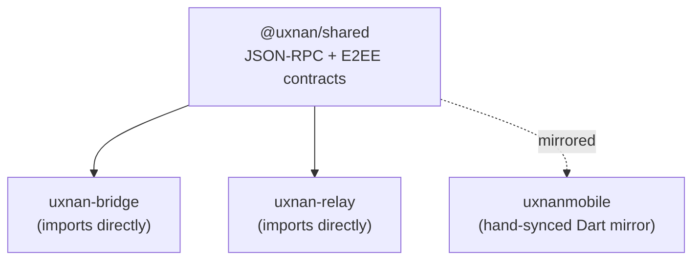

# @uxnan/shared


Shared JSON-RPC and E2EE contracts for the [Uxnan](../README.md) ecosystem — the
single source of truth every component agrees on. Consumed as a local workspace
dependency by the **[bridge](../bridge/README.md)** and the
**[relay](../relay/README.md)**; the mobile app keeps manually-synced Dart
equivalents (see
[`architecture/02b-contracts-and-requirements.md`](../architecture/02b-contracts-and-requirements.md)
§1 for the canonical contract list).

> **Status:** implemented and stable — **62 JSON-RPC methods** + **8 streaming
> notifications**, kept lock-step at build time with the `METHOD_NAMES` array and
> the `StreamNotification` enum (a compile-time assertion in
> `src/jsonrpc/method-registry.ts` fails the build on any drift). Changes are
> recorded in [`CHANGELOG.md`](CHANGELOG.md).

## Why it exists

Three independent codebases — a Node.js bridge, a Node.js relay, and a Flutter app
— have to agree on exactly the same messages on the wire. Rather than letting each
one drift its own way, every shape lives here once: the request and response
envelopes, the streaming notifications, the E2EE handshake, the pairing payload,
and the domain and agent models. The bridge and relay import this package
directly; the mobile app mirrors it in Dart. When a contract changes, it changes
here first, and the build refuses to pass if the registry and the spec disagree.

<details>
<summary><b>Diagram — one contract, three consumers</b></summary>



</details>

## What's inside

| Area | Exports |
|---|---|
| JSON-RPC | envelope types + constructors (`makeRequest`, `makeNotification`, `makeResponse`, `makeErrorResponse`), error codes (`JsonRpcErrorCode` + Uxnan-specific `-32000..-32008`), `RpcError`, typed method registry (`JsonRpcMethodRegistry` + `METHOD_NAMES`), `isKnownMethod` |
| Streaming | `StreamNotification` enum + param types (`TurnStartedParams`, `MessageDeltaParams`, `ThinkingDeltaParams`, `ContentBlockParams`, `TurnCompletedParams`, `TurnUsage`, `TurnErrorParams`, `TurnAbortedParams`, `ModelResolvedParams`) |
| E2EE | handshake messages (`clientHello` / `serverHello` / `clientAuth` / `ready`), `buildHandshakeTranscript`, `SecureEnvelope`, `PairingPayload` v2 (`relay` optional + `hosts: string[]`) with `Base64(utf8(JSON))` QR encoding |
| Models | thread / turn / message (with `MessageContent` polymorphic blocks), git, workspace (incl. `browseDirs` + `exists`), project, auth, session/trust (`BridgeStatus` incl. `latestVersion?`/`updateAvailable?`), approval |
| Agents | `IAgentAdapter` (with `respondApproval`, `listModels`, `nativeSessionId`, `SendTurnOptions { threadId, turnId, text, service?, effort?, options?, attachments?, cwd?, accessMode? }`), `AgentModel` (incl. `version?`, `isDefault?`, `options?`, `contextWindow?`, `isLatestAlias?`), `AgentCapabilities` (incl. `images`, `approvals`, `reportsContextUsage`), `AgentConfig` (cwd, agentId, model, plus optional `binaryPath`/`extraArgs`) |
| Version | `compareVersions` / `isNewerVersion` — dependency-free SemVer precedence (used by the bridge's npm update check) |
| Validation | Ajv validators for requests, responses, envelopes, pairing payload, push payloads |

## Usage

```ts
import {
  makeRequest,
  isKnownMethod,
  validateJsonRpcRequest,
  METHOD_NAMES,
  type AgentModel,
  type PairingPayload,
} from '@uxnan/shared';
```

## Develop

```bash
npm run build      # tsc → dist/
npm test           # tsc + node --test dist/test
npm run typecheck  # tsc --noEmit
```

Requires Node ≥18. The package is ESM-only.

## Source of truth

The canonical contract list lives in this package — see
[`src/jsonrpc/method-registry.ts`](src/jsonrpc/method-registry.ts) (`METHOD_NAMES`)
and [`src/jsonrpc/notifications.ts`](src/jsonrpc/notifications.ts)
(`StreamNotification`). The spec mirrors it in
[`architecture/02b-contracts-and-requirements.md`](../architecture/02b-contracts-and-requirements.md)
§1.2 / §1.4. Per `AGENTS.md` → *Spec drift control*, any change here MUST be
reflected in the spec in the same change set.

## Publish (planned)

`@uxnan/shared` is published to npm **first**; `uxnan-bridge` and `uxnan-relay`
then pin `"@uxnan/shared": "^0.x"` instead of the `"*"` workspace spec they
use today. See `bridge/FOR-DEV.md` → *Packaging*.
