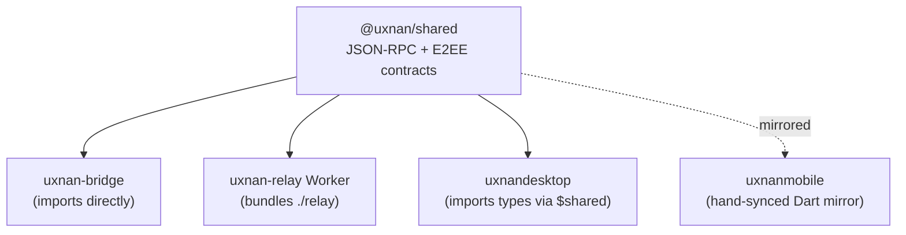

# @uxnan/shared


Shared JSON-RPC and E2EE contracts for the [Uxnan](../README.md) ecosystem — the
single source of truth every component agrees on. Consumed as a local workspace
dependency by the **[bridge](../bridge/README.md)** and the
**[relay](../relay/README.md)** (which bundles only the dependency-free
`@uxnan/shared/relay` subpath into its Worker); **[Uxnan Desktop](../uxnandesktop/README.md)**
imports its types straight from `src/` (the `$shared` alias) for the chats it
drives through the bridge; the mobile app keeps manually-synced Dart
equivalents (see
[`architecture/02b-contracts-and-requirements.md`](../architecture/02b-contracts-and-requirements.md)
§1 for the canonical contract list).

> **Status:** implemented and stable — **103 JSON-RPC methods** + **25 streaming
> notifications**, kept lock-step at build time with the `METHOD_NAMES` array and
> the `StreamNotification` enum (a compile-time assertion in
> `src/jsonrpc/method-registry.ts` fails the build on any drift). Changes are
> recorded in [`CHANGELOG.md`](CHANGELOG.md).

## Why it exists

Four independent codebases — a Node.js bridge, a relay that runs as a
Cloudflare Worker, a Tauri + Svelte desktop app and a Flutter app — have to agree on exactly the same messages on
the wire. Rather than letting each one drift its own way, every shape lives here
once: the request and response envelopes, the streaming notifications, the E2EE
handshake, the pairing payload, and the domain and agent models. The bridge and
relay import this package directly, Uxnan Desktop imports its types from source,
and the mobile app mirrors it in Dart. When a contract changes, it changes here
first, and the build refuses to pass if the registry and the spec disagree.

<details>
<summary><b>Diagram — one contract, four consumers</b></summary>


```mermaid
flowchart TB
  shared["@uxnan/shared<br/>JSON-RPC + E2EE contracts"]
  bridge["uxnan-bridge<br/>(imports directly)"]
  relay["uxnan-relay Worker<br/>(bundles ./relay)"]
  desktop["uxnandesktop<br/>(imports types via $shared)"]
  mobile["uxnanmobile<br/>(hand-synced Dart mirror)"]
  shared --> bridge
  shared --> relay
  shared --> desktop
  shared -. mirrored .-> mobile
```

</details>

## What's inside

| Area | Exports |
|---|---|
| JSON-RPC | envelope types + constructors (`makeRequest`, `makeNotification`, `makeResponse`, `makeErrorResponse`), error codes (`JsonRpcErrorCode` + Uxnan-specific `-32000..-32010`), `RpcError`, typed method registry (`JsonRpcMethodRegistry` + `METHOD_NAMES`), `isKnownMethod` |
| Streaming | `StreamNotification` enum + param types (`TurnStartedParams`, `MessageDeltaParams`, `ThinkingDeltaParams`, `ContentBlockParams`, `TurnCompletedParams`, `TurnUsage`, `TurnErrorParams`, `TurnAbortedParams`, `ModelResolvedParams`, and the multi-client set: `ThreadUpdatedParams`, `ThreadDeletedParams`, `TurnCreatedParams`, `ApprovalResolvedParams`, `QuestionResolvedParams`) |
| Local control | the loopback channel Uxnan Desktop uses on the bridge's machine: `LOCAL_CONTROL_FILE` / `LOCAL_CONTROL_PATH`, `LocalControlDiscovery`, the `LocalControlFrame` union (`hello` + `message`), `isValidLocalClientId`, `localReceiverId` (architecture/02a §5.8.15) |
| Replica sync | `sync/changes` (`SyncChanges`: revisioned threads, projects, settings, deletions, presence), `BridgeSettings { home, name, relay }`, `ClientPresence`, `Project` registry fields, `Turn.seq`, `Thread.origin` (`src/models/sync.ts`, architecture/02a §5.8.17) |
| Agent locations | `agent-locations.json` (package root) + `locateAgent` / `agentLocation`: where every agent CLI installs — the one table the bridge and Uxnan Desktop resolve from |
| E2EE | handshake messages (`clientHello` / `serverHello` / `clientAuth` / `ready`), `buildHandshakeTranscript`, `SecureEnvelope`, `PairingPayload` v3 (`relay?: PairingRelay { url, routingId, ticket? }` + `hosts?: string[]`, at least one) with `Base64(utf8(JSON))` QR encoding |
| Relay | **`@uxnan/shared/relay`** (subpath export, dependency-free so the Worker can bundle it; also re-exported from the root): the relay control protocol — routes `/v1/host` · `/v1/connect` · `/v1/channel` (`relayRoutePath`, `parseRelayPath`), `relaySigningMessage`, the challenge / auth / `ready` / `allow` / `ticket` / `dial` frames and their parsers, `RELAY_CLOSE` (4001–4011), `RELAY_PING`/`RELAY_PONG`, limits and timeouts, `RELAY_COMPATIBILITY_DATE` (architecture/02a §5.10). Models in `src/models/relay.ts`: `RelayEndpoint`, `RelayStatus` (incl. `hostKey`), `RelaySetupParams`, `RelayUseParams`, `RelaySetParams`, `RelayCredentialParams`, `RelayRemoveParams`, `RelayUpdatedNotification` — for `relay/status` · `setup` · `use` · `set` · `update` · `rotate` · `remove` and `stream/relay/updated` |
| Models | thread / turn / message (with `MessageContent` polymorphic blocks), durable `CompactionContentBlock` and `AssistantResponseBoundaryBlock`, git, workspace (incl. `browseDirs` + `exists`), project, auth, session/trust (`BridgeStatus` incl. `latestVersion?`/`updateAvailable?`), bridge-owned profile metrics (complete-ledger export/import), approval, question (interactive multiple-choice) |
| Agent sessions | `agent/sessions` · `holds` · `hold` · `release` · `requestHandoff` · `handoffAnswer` (`AgentSessionSummary`, `AgentSessionHold`, hand-off outcomes), `stream/agent/held` / `handoffRequested`, `SessionHeld` (`-32010`), `ONE_SHOT_PROMPT_OPENERS` / `isOneShotPrompt` (`src/models/agent-session.ts`, `src/agents/one-shot.ts`, architecture/02a §5.8.19) |
| Agents | `IAgentAdapter` (with `respondApproval`, `listModels`, `nativeSessionId`, `adoptNativeSession`, `listNativeSessions` → `NativeSessionInfo`, `SendTurnOptions { threadId, turnId, text, service?, effort?, options?, attachments?, cwd?, accessMode? }`), `AgentModel` (incl. `version?`, `isDefault?`, `options?`, `contextWindow?`, `isLatestAlias?`), `AgentCapabilities` (incl. `images`, `approvals`, `reportsContextUsage`, `reportsCompaction`), `AgentDescriptor.deprecated`, `AgentConfig` (cwd, agentId, model, plus optional `binaryPath`/`extraArgs`) |
| Version | `compareVersions` / `isNewerVersion` — dependency-free SemVer precedence (used by the bridge's npm update check) |
| Validation | Ajv validators for requests, responses, envelopes, pairing payload |

## Usage

```ts
import {
  makeRequest,
  isKnownMethod,
  validateJsonRpcRequest,
  METHOD_NAMES,
  type AgentModel,
  type PairingPayload,
} from '@uxnan/shared';

// Code that must not pull Ajv or Node built-ins (the relay Worker):
import { parseRelayClientFrame, RELAY_CLOSE } from '@uxnan/shared/relay';
```

## Develop

```bash
npm run build      # tsc → dist/
npm test           # tsc + node --test dist/test
npm run typecheck  # tsc --noEmit
```

Requires Node ≥18. The package is ESM-only.

## Source of truth

The canonical contract list lives in this package — see
[`src/jsonrpc/method-registry.ts`](src/jsonrpc/method-registry.ts) (`METHOD_NAMES`)
and [`src/jsonrpc/notifications.ts`](src/jsonrpc/notifications.ts)
(`StreamNotification`). The spec mirrors it in
[`architecture/02b-contracts-and-requirements.md`](../architecture/02b-contracts-and-requirements.md)
§1.2 / §1.4. Per `AGENTS.md` → *Spec drift control*, any change here MUST be
reflected in the spec in the same change set.

## Published

`@uxnan/shared` is published to npm; `uxnan-bridge` then pins
`"@uxnan/shared": "^0.x"` — the release workflow replaces the `"*"` workspace
spec with the exact published version at build time. The relay is not
published: its Worker bundle (shared protocol included) ships inside the
bridge package.
See `bridge/FOR-DEV.md` → *Packaging*.
