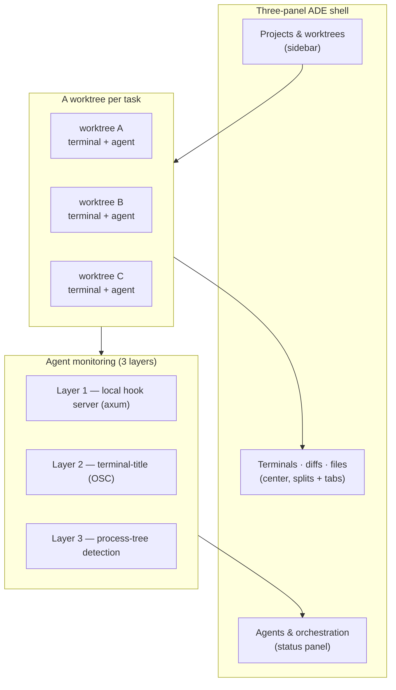

# Uxnan Desktop — Agent Development Environment (ADE)

A lightweight, terminal-centric desktop app to **orchestrate multiple CLI AI
agents in parallel**, each isolated in its own git worktree and pseudoterminal.
Not an IDE — an orchestration, monitoring, and change-review layer.

Built with **Rust + Tauri 2** (backend) and **Svelte 5 / SvelteKit + Tailwind
CSS v4 + shadcn-svelte** (frontend). Terminals use xterm.js; diffs use
CodeMirror 6.


> Part of the [Uxnan](../) monorepo. The full specification is the source of
> truth — start at [`architecture/00-index.md`](architecture/00-index.md).
> The engineering roadmap and deferred work live in [`FOR-DEV.md`](FOR-DEV.md);
> human-provided assets in [`FOR-HUMAN.md`](FOR-HUMAN.md).

## Why it helps, even in alpha

Uxnan Desktop is for developers who want a clear, multi-agent workflow without
paying the resource cost of a full IDE or an Electron shell. Because it renders
through the operating system's native webview instead of bundling its own browser,
it targets **30–100 MB of RAM** where comparable Electron applications routinely
sit at **200–500 MB**. That difference is the point: it is meant to be a practical
choice on low-to-moderate-resource machines, not only on high-end workstations,
while still offering an intuitive interface for running and reviewing several
agents at once.

It is deliberately **not an IDE**. It is an orchestration, monitoring, and
change-review layer, and any CLI agent works inside it without modification.

## What it does

The application is **alpha-functional as a standalone app**. The capabilities
available today are:

- **Parallel, isolated agents.** Every task gets its own git worktree, its own
  terminal workspace, and its own agent, so one agent's work never collides with
  another's, and switching between them is a single click rather than a `git
  stash` / `git checkout` cycle.
- **A full terminal multiplexer.** Tabs, nested splits, drag-to-reorder and the
  ability to move tabs across panes, `Ctrl+Tab` MRU cycling, WebGL rendering, and
  scrollback that survives recreating a pane — built on `portable-pty` and
  xterm.js.
- **Integrated Git review.** Status, stage, commit, push and pull, with a unified
  or side-by-side diff viewer (CodeMirror 6), **hunk-level staging**, visual image
  diffs, squash-merged branch cleanup on worktree removal, WSL repositories routed
  through `wsl.exe`, and optional **AI-generated commit messages** drafted by a
  local CLI agent from your staged diff.
- **Agent monitoring.** Three layers — a precise local hook server, terminal-title
  inference, and process-tree detection — drive colored status dots, unread / done
  badges, and native idle notifications, so you always know whether an agent is
  working, blocked, waiting, or done.
- **Multi-agent orchestration.** With two or more live agents, a console routes a
  message to all of them, to one agent type (fan-out), or to a coordinator's
  workers, applying backpressure so no agent receives a new message before it is
  free.
- **AI-provider usage.** A **Providers** settings section shows how much of each
  quota you've consumed — session / weekly / monthly windows (with resets), plan,
  account and credit balance — for **Codex, Claude, Copilot and Gemini**. It reads
  each CLI's own signed-in token and calls the provider's official usage API (never
  cookies or pasted keys), polling **only the providers you activate**. A status-bar
  gauge surfaces the meters you pick. See [provider usage](./docs/providers.md).
- **Integrated developer browser.** A complete in-app browser in a right-side panel
  (a real system webview docked to the app, so it loads any site and has real
  DevTools) to preview and debug what your agents build — `localhost` dev servers
  and any site — and to open the links they create. Links route by a policy you
  choose (in-app · system browser · ask); when allowed, agents open URLs in it
  automatically — and, via an injected **browser-control MCP server**, discover
  `browser_*` tools to preview and test what they build with no setup. See
  [the integrated browser](./docs/browser.md).
- **Personalization and internationalization.** Full custom theming with design
  tokens and light/dark modes, terminal profiles, per-agent launch settings and
  environment variables, a configurable launch shell, and a completely translated
  interface in **English and Spanish**.
- **In-app auto-updates.** Checks GitHub Releases on a chosen channel
  (**stable** or **nightly**), downloads new versions in the background, and
  installs on your terms — and because installing restarts the app (which stops
  running agents), it waits for agents to go idle or for your explicit go-ahead.
  See [updates & release channels](./docs/updates.md).

<details>
<summary><b>Diagram — the three-panel ADE, a worktree per task, layered monitoring</b></summary>



</details>

## Platform support

Uxnan Desktop is cross-platform by construction — Tauri 2 targets Windows, macOS
and Linux — but **all current testing has been carried out directly on Windows**.

- **Windows** — actively developed and tested; this is the validated platform
  today.
- **Linux** — expected to work and built in CI, but not yet exercised end-to-end
  by the maintainer. If you run it on Linux, your feedback and recommendations are
  genuinely welcome; please open an issue or a discussion so the experience can be
  hardened.
- **macOS** — supported by the toolchain, but no maintainer builds are produced
  yet and the platform is unvalidated. Until a signed build exists, macOS users
  can build it themselves by following
  [release builds & packaging](docs/build.md).

The only remaining roadmap phase is **Phase 6 (bridge integration / mobile
pairing)**, which is *optional for standalone use* — required only if you want the
ADE to double as the mobile bridge (otherwise install `uxnan-bridge` separately).
The detailed implementation status (phases, test counts, pre-release gaps) lives
in [`FOR-DEV.md`](FOR-DEV.md).

## Docs

Detailed docs live in [`docs/`](./docs/):
[development & running in debug](./docs/development.md) ·
[release builds & packaging](./docs/build.md) ·
[testing & verification](./docs/testing.md) ·
[architecture orientation](./docs/architecture.md) ·
[design tokens](./docs/design-tokens.md) ·
[theming & appearance](./docs/theming.md) ·
[internationalization (i18n)](./docs/i18n.md) ·
[agent launch & configuration](./docs/agent-launch.md) ·
[provider usage statistics](./docs/providers.md) ·
[multi-agent orchestration](./docs/orchestration.md) ·
[agent hooks (precise states)](./docs/agent-hooks.md) ·
[integrated browser](./docs/browser.md) ·
[updates & release channels](./docs/updates.md).

The full product/engineering specification is in
[`architecture/`](architecture/00-index.md).

## Layout

```
uxnandesktop/
├── architecture/          # Spec (source of truth) — Phase 0-5+S status; Phase 6 pending
├── docs/                  # Task-focused docs (install, build, test, i18n, hooks, ...)
├── src/                   # SvelteKit frontend (SPA)
│   ├── app.css            # Tailwind v4 + shadcn-svelte tokens
│   ├── lib/
│   │   ├── api.ts         # typed wrappers over Tauri commands
│   │   ├── types.ts       # TS mirror of the Rust model
│   │   ├── state/         # reactive Svelte 5 stores (runes)
│   │   ├── i18n/          # EN/ES translations
│   │   ├── components/    # shadcn-svelte primitives + app components
│   │   └── ...            # diff.ts, clipboard.ts, agentCatalog.ts, etc.
│   └── routes/            # +layout.svelte, +page.svelte (three-panel shell)
├── src-tauri/             # Rust backend
│   └── src/
│       ├── lib.rs         # Tauri builder, state wiring, command registration
│       ├── main.rs        # entrypoint
│       ├── model.rs       # AppData / RepoData / WorktreeData / settings
│       ├── persistence.rs # atomic JSON (write-rename) + 5 rotating backups + migrations
│       ├── state.rs       # AppState (RwLock<AppData> + PersistenceManager)
│       ├── commands.rs    # Tauri commands (git, pty, worktree, browse, agent, ...)
│       ├── pty.rs         # portable-pty manager
│       ├── git.rs         # git CLI wrapper (worktrees, branches, status, commit)
│       ├── gitfast.rs     # git2 fast path (status / diff / numstat / log / show)
│       ├── hooks.rs       # axum HTTP hook server (Layer 1 agent monitoring)
│       ├── agent_hooks.rs # per-agent hook configs (Claude auto-install + wrappers)
│       ├── procscan.rs    # process-tree detection (Layer 3)
│       ├── power.rs       # keep-awake (Win; macOS/Linux untested)
│       ├── browse.rs      # in-app directory picker
│       ├── fs.rs          # file read/write for the center editor
│       ├── fswatch.rs     # filesystem watcher (file-tree auto-refresh)
│       ├── which.rs       # agent/shell install detection
│       └── error.rs       # AppError / CommandError
├── components.json        # shadcn-svelte config
└── package.json
```

## Develop

Prereqs: Node ≥ 18, Rust (stable), and the Tauri 2 system deps (WebView2 on
Windows). This sub-project uses **npm** (the machine's home `pnpm-workspace.yaml`
makes `pnpm install` no-op here).

```bash
cd uxnandesktop
npm install            # frontend deps
npm run check          # svelte-check (type check)
npm test               # Vitest unit tests (pure logic)
npm run build          # build the SPA → build/  (required by `cargo build`'s generate_context!)
npm run tauri dev      # run the desktop app (compiles Rust on first run)
```

Backend (from `src-tauri/`):

```bash
cargo test             # backend unit tests
cargo clippy --all-targets
cargo fmt
```

For a frontend-only browser flow (no Tauri shell): see
[`docs/development.md`](./docs/development.md).

## Conventions

- Rust: `snake_case` fns, `PascalCase` types, `Result` + `thiserror`, async I/O
  on Tokio, tests in-file with `#[cfg(test)]`.
- Svelte 5: runes (`$state`/`$derived`/`$effect`), `PascalCase.svelte`
  components, `camelCase` members.
- Tailwind: utility-first, dark via the `.dark` class, tokens in `app.css`.
- Commits: Conventional Commits with desktop scopes (`rust`, `svelte`,
  `terminal`, `git`, `agent`, `tauri`, `bridge-embed`, `ui`, `config`).
