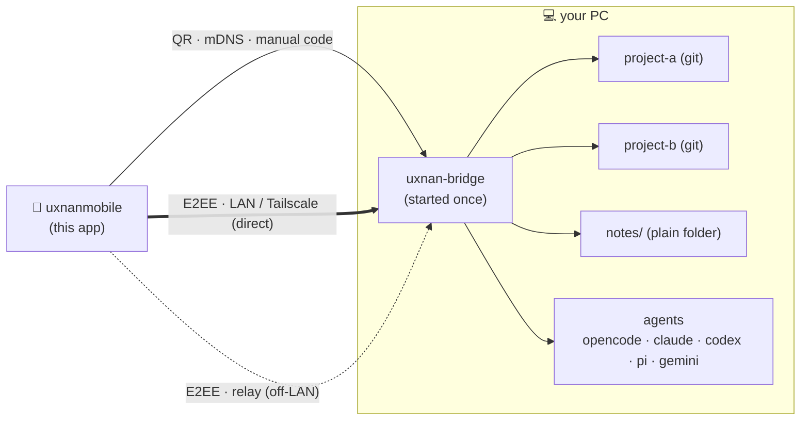

# uxnanmobile

Flutter mobile client (Android + iOS) for **[Uxnan](../README.md)** — a remote
control for the AI coding agents running on your PC, over an end-to-end encrypted
channel. It is the part of the ecosystem you carry with you: the bridge does the
work on the PC, and this app is how you watch it, steer it, and review it from
anywhere.


> **Status: Android ALPHA-READY. iOS pending FOR-HUMAN assets** (APNs key,
> `Info.plist` usage strings, signing; the first build requires macOS).
>
> Full technical specification: [`../architecture/`](../architecture/00-index.md).
> The architecture docs are the source of truth; this app implements them.

## What sets it apart

There is no shortage of "control your agent from your phone" tools. Uxnan takes a
deliberately different set of positions, and most of them are felt directly from
this app:

- **Provider-agnostic, real multi-agent support.** It is not tied to a single
  vendor. Five real agents are wired today — OpenCode, Claude Code, Codex, pi and
  Gemini CLI — and you select the agent and model per conversation.
- **Strong encryption that is never optional.** Every message to and from the PC
  travels through a real end-to-end encrypted channel (X25519 + Ed25519 +
  AES-256-GCM + HKDF). There is no "plaintext mode".
- **Fully open source.** The entire ecosystem, this app included, is released
  under the [MPL-2.0](../LICENSE) license. Nothing about how it connects to your
  machine is hidden.
- **One bridge, every project.** The bridge is started **once**, from a single
  location on your PC, and from the app you can open a conversation in **any**
  project beneath it — Git repositories or plain folders alike — without
  relaunching anything per project. A built-in folder browser (`workspace/
  browseDirs`) lets you root a new conversation wherever the bridge allows.
- **Effortless connection.** Pairing is as simple as scanning a QR, and the app
  can also **discover nearby bridges** automatically over mDNS or accept a short
  manual code — no addresses to memorize, no compile-time configuration. A
  transport indicator always tells you whether you are connected **directly** (LAN
  / Tailscale) or **through the relay**.
- **Parity with the bridge's main capabilities.** Streaming conversations with
  structured agent turns, interactive approvals, model and reasoning-effort
  selection, a live context-usage indicator, per-agent sign-in status, voice and
  image input, and a full Git screen are all available from the phone.
- **Full custom theming.** Beyond system light/dark, a dedicated Theme Manager
  lets you build, preview, import and export your own themes (single- or
  dual-brightness), so the app genuinely looks the way you want.

<details>
<summary><b>Diagram — the phone, one bridge, and every project under it</b></summary>



</details>

## Stack

| Concern | Choice |
|---|---|
| Language / SDK | Dart 3.4+, Flutter 3.22+ |
| Architecture | Clean Architecture — `core/`, `domain/`, `application/`, `infrastructure/`, `presentation/` |
| State management | Riverpod **3.x** (manual providers, **no** code generation) |
| Navigation | `go_router` |
| UI | Material 3 (+ "Neural Expressive" M3 Expressive design language), adaptive light/dark, centralized design tokens |
| Local persistence | `drift` (SQLite) — 7 tables |
| Secure storage | `flutter_secure_storage` (Keychain / Keystore) |
| Crypto | `cryptography` + `pointycastle` (X25519, Ed25519, AES-256-GCM, HKDF) |
| Lint | `very_good_analysis` |

Package id: `dev.luisgamas.uxnanmobile` · Dart package name: `uxnan` (imports use
`package:uxnan/...`).

## Project layout (`lib/`)

```
core/            cross-cutting utilities (constants, errors, extensions, utils)
domain/          entities, value_objects, enums, repositories, services (pure Dart)
application/     coordinators, managers, processors (use cases orchestration)
infrastructure/  transport, storage (drift), repositories, platform, crypto,
                 notifications, pairing, speech, media, updates
presentation/    screens, widgets, providers, router, theme
l10n/            generated localizations (en, es)
```

Layer import rules (enforced by review + analysis), per spec 03 §1.5:
`presentation → domain/application` · `application → domain` ·
`infrastructure → domain` · `domain → (pure)` · `core → (none)`.

## Getting started

```bash
flutter pub get
flutter gen-l10n          # regenerate localizations after editing l10n/*.arb
flutter run \
  --dart-define=ENV=dev \
  --dart-define=ENABLE_LOGGING=true
```

> **No `RELAY_URL` needed to connect.** The bridge address comes from the
> **pairing QR**: a fresh bridge is **LAN/Tailscale-direct** (`relayEnabled`
> defaults to `false`) and advertises its direct `host:port`s, which the phone
> tries first. The relay is **optional** — self-hosted, used only as a remote
> fallback. When a paired bridge advertises a relay URL, the phone reads it
> from the QR; nothing is injected at compile time.

### Build flavors

Configuration is injected at compile time with `--dart-define` (spec 03 §3.3):

| Variable | dev | staging | prod (default) |
|---|---|---|---|
| `ENV` | `dev` | `staging` | `prod` |
| `ENABLE_LOGGING` | `true` | `true` | `false` |

## Quality

```bash
dart format lib test
flutter analyze            # must report 0 issues (no warnings)
flutter test               # unit + widget tests
```

## Status

**MVP wired — Android alpha-ready.** Every core module is implemented and
connected to live bridge data, validated on-device against a real bridge:
pairing + E2EE transport, live streaming conversations with structured agent
turns, the model picker and run-option knobs, context-usage and sign-in
indicators, interactive approvals, voice and image input, per-PC threads, a full
Git screen, and Android push.

The detailed, always-current feature inventory and what's left (Bug A relink
latency, OpenCode/pi interactive approvals — a bridge-side gap — the automated
integration test, and all iOS work) lives in [`FOR-DEV.md`](FOR-DEV.md); pending
iOS/Apple assets are in [`FOR-HUMAN.md`](FOR-HUMAN.md); the full history is in
[`CHANGELOG.md`](CHANGELOG.md).

## Documentation

Developer reference lives in [`docs/`](docs/README.md): the as-built
[architecture](docs/architecture.md), the [testing guide](docs/testing.md), and
the [conventions](docs/conventions.md). The product/design spec (source of
truth) is the monorepo [`architecture/`](../architecture/00-index.md).
